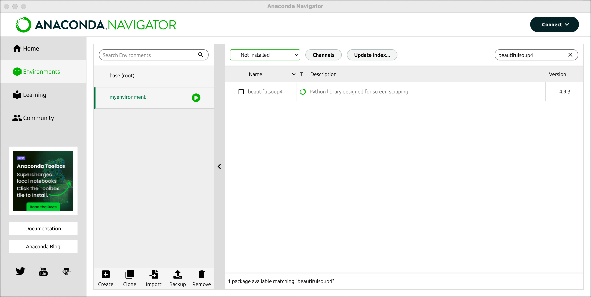

## Anaconda 是什么？为什么使用它？

Anaconda 是面向数据科学、机器学习和 Python 开发的发行版，集成了 Python、Conda 包管理器、虚拟环境管理以及 Jupyter Notebook 等常用工具。本教程适合零基础读者，将依次讲解 Anaconda 安装、Conda 环境管理、国内镜像源配置、pip 换源和常见问题排查。


**为什么要学 Anaconda？**

简单来说，Anaconda 就像是一个 **"Python 应用商店 + 全能工具箱"** 的组合体。它能帮你一键安装数据分析、机器学习所需要的全部工具库——比如 NumPy、pandas、Matplotlib 这些在数据科学领域高频使用的核心库，而且还能帮你**隔离管理不同的项目环境**，彻底避免"装一个包就把整个系统搞崩"的尴尬局面。对于数据科学和机器学习的初学者而言，Anaconda 几乎是最低门槛的入门方式。

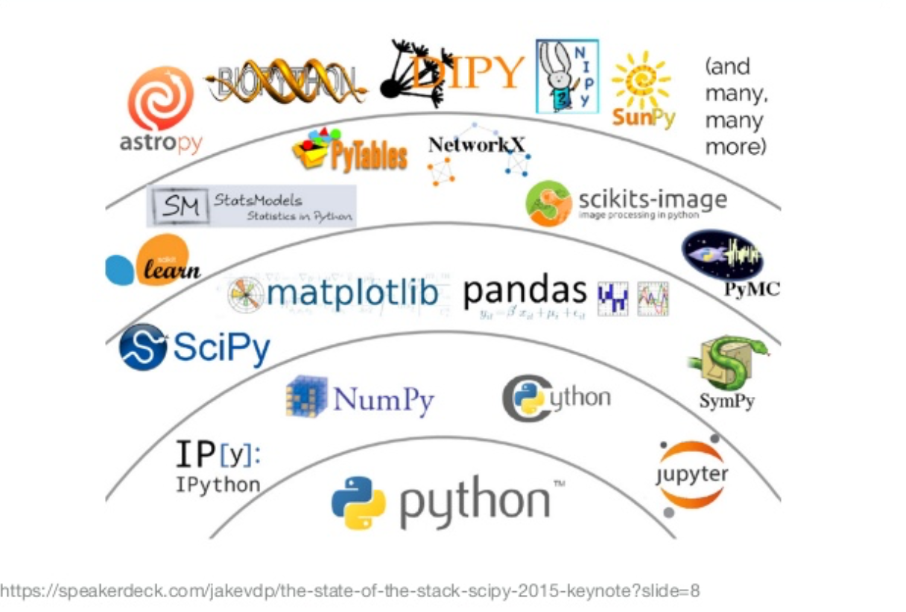

上图展示了 Python 数据科学生态系统的核心组件——Anaconda 将这些分散的工具整合到了一个统一的发行版中，省去了你逐个安装配置的麻烦。

## Anaconda 安装前的准备工作

- **不需要任何编程基础**：全程跟着复制粘贴命令即可完成所有操作
- **图形界面优先**：能用鼠标点完成的，绝不让你敲命令
- **遇到问题不要慌**：文末整理了新手最常踩的坑及解决方案
- **预留 10 分钟左右的时间**：安装过程需要一些耐心等待，尤其是网络不好的情况下

---

## 第一步：下载并安装 Anaconda

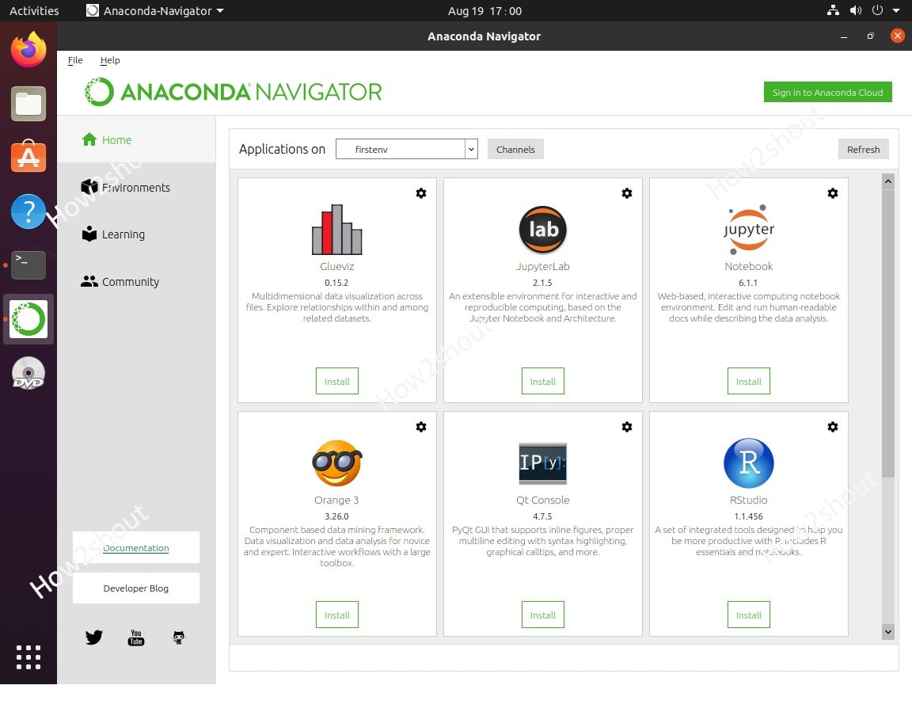

上图就是安装完成后打开的 **Anaconda Navigator**——这是 Anaconda 自带的图形化管理界面，你可以用它来启动 Jupyter Notebook、Spyder 等工具，也可以直接管理环境和包，完全不需要敲命令。

### 1.1 下载 Windows、macOS 或 Linux 安装包

👉 **官方下载地址**（复制到浏览器打开）：
https://www.anaconda.com/download

**小白选择指南：**

| 操作系统 | 选择哪个版本                         | 备注                                  |
| -------- | ------------------------------------ | ------------------------------------- |
| Windows  | Windows → 64-Bit Graphical Installer | 目前绝大多数电脑都是 64 位系统        |
| macOS    | macOS → PKG 安装包                   | 注意区分 Intel 芯片和 M 系列芯片      |
| Linux    | Linux → 对应发行版安装包             | 选择 Linux 的同学大概已经有一定基础了 |

> 💡 **温馨提示**：安装包体积约 950 MB，建议使用迅雷、IDM 等下载工具加速下载，避免浏览器直接下载因网络波动导致失败。

### 1.2 Windows 安装步骤

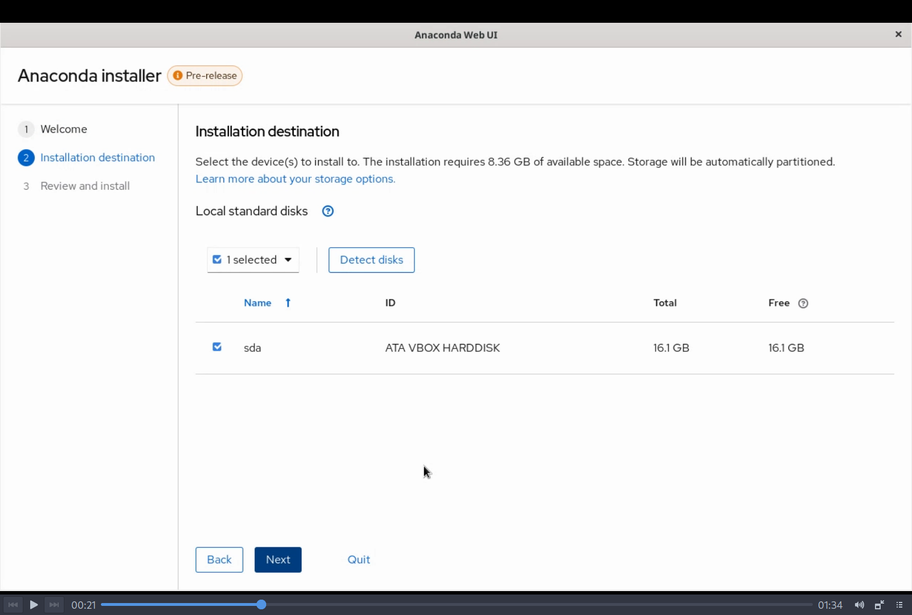

**第 1 步**：双击下载好的安装包，出现类似上图的 Anaconda 安装欢迎界面后，点击 **"Next"** 继续。

**第 2 步**：阅读许可协议，勾选 **"I Agree"** 同意协议条款（不同意的话就无法继续安装了）。

**第 3 步**：选择安装方式——推荐选 **"Just Me"**（仅当前用户），这样不需要管理员权限，也更安全。点击 **"Next"**。

**第 4 步**：选择安装路径——**这一步非常关键！**

- ❌ **强烈不建议**安装在 C 盘，Anaconda 体积庞大，后续安装的包也会占用大量空间，容易导致 C 盘爆满。
- ✅ **推荐路径**：将安装路径修改为 `D:\Anaconda3`（直接在地址栏里把盘符从 C 改成 D 即可）。

**第 5 步**：高级选项设置——**两个选项务必都勾选！**

- ✅ **"Add Anaconda3 to my PATH environment variable"**：将 Anaconda 添加到系统环境变量，这样你才能在任何位置使用 `conda` 命令。
- ✅ **"Register Anaconda3 as my default Python"**：将 Anaconda 注册为系统默认的 Python 解释器。

点击 **"Install"** 开始安装。

**第 6 步**：耐心等待安装进度条走完。安装完成后，**取消勾选** "Learn about Anaconda Cloud"（这个后面不需要），然后点击 **"Finish"** 完成安装。

### 1.3 验证 Anaconda 和 Conda 是否安装成功

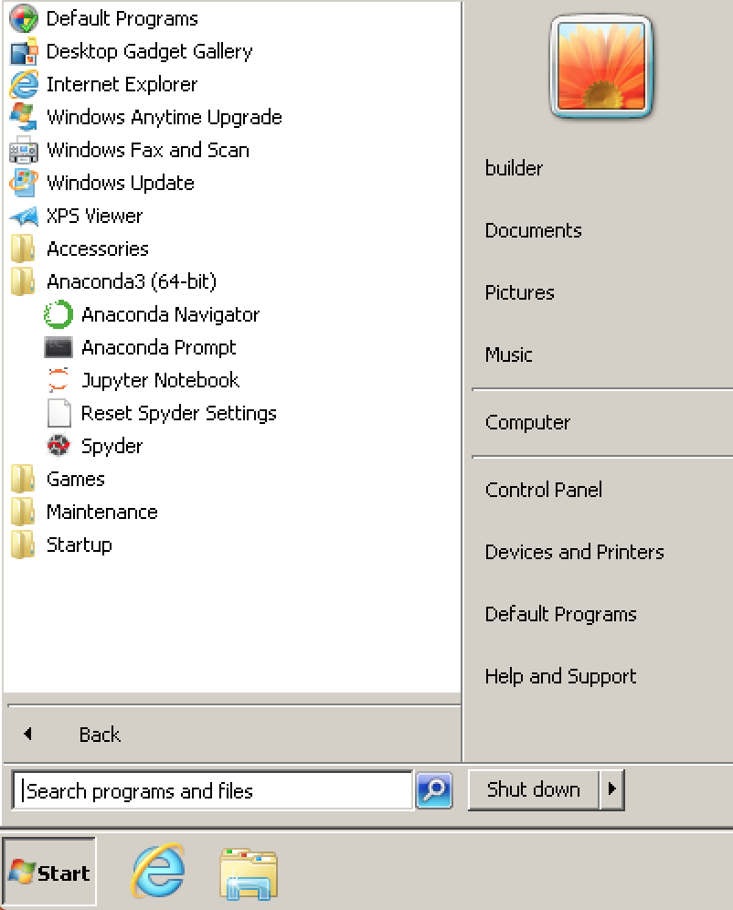

打开 **Anaconda Prompt**（开始菜单 → Anaconda3 文件夹 → Anaconda Prompt），然后依次输入以下两条验证命令：

```bash
conda --version
python --version
```

如果安装成功，你会看到类似如下的版本号输出：

- `conda 24.9.0`
- `Python 3.12.4`

> 💡 **小知识**：Anaconda Prompt 和普通的 cmd 命令提示符不同，它启动时会自动激活 Anaconda 的 base 环境，所以能直接识别 `conda` 命令。

**❌ 如果提示"conda 不是内部或外部命令"或"命令找不到"：**

- 首先检查安装时是否勾选了 **"Add to PATH"** 选项。
- 如果已勾选但仍不生效，尝试**重启电脑**后再试（环境变量修改需要重启才能全局生效）。
- 如果重启后仍然不行，请参考文末「问题 1」的手动添加环境变量方法。

---

## 第二步：配置 Conda 和 pip 国内镜像源

### 2.1 为什么需要配置国内镜像源？

Anaconda 默认从国外的官方服务器下载软件包，这就像你从美国海淘一件商品——路途遥远、速度缓慢，还经常因为网络波动导致下载中断。"换源"就是把下载源切换到国内的镜像服务器，相当于从国内的"本地仓库"直接拿货，速度通常能提升 **10 到 100 倍**。

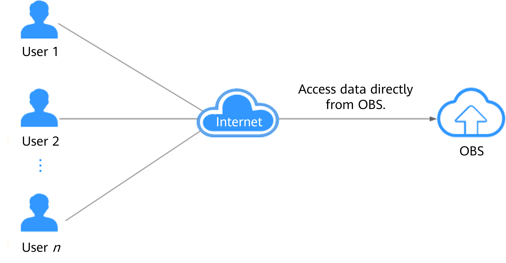

> 💡 **实际体验对比**：以安装 NumPy 为例，使用默认源下载通常需要 2-5 分钟，换用清华源后仅需 **5-10 秒**即可完成。

### 2.2 配置 Conda 清华镜像源

#### 🖥️ Windows 系统

1. 打开 **Anaconda Prompt**：点击开始菜单 → 找到 **"Anaconda3"** 文件夹 → 点击 **"Anaconda Prompt"**（会打开一个黑色命令窗口，和普通的 cmd 长得不一样）。

2. 依次复制粘贴以下命令（**一行一行执行，每粘贴一行按一次回车**）：

```bash
# 添加清华大学镜像源（目前国内最稳定、更新最及时的镜像站）
conda config --add channels https://mirrors.tuna.tsinghua.edu.cn/anaconda/pkgs/main/
conda config --add channels https://mirrors.tuna.tsinghua.edu.cn/anaconda/pkgs/free/
# 设置搜索时显示包的下载地址，方便确认是否走了镜像源
conda config --set show_channel_urls yes
```

3. **验证是否换源成功**：输入 `conda info` 命令，在输出结果中找到 `channels` 部分。如果能看到以 `https://mirrors.tuna.tsinghua.edu.cn` 开头的地址，就说明换源成功了。

#### 🍎 macOS / Linux 系统

1. 打开终端：
   - **macOS**：启动台 → 其他文件夹 → 终端（Terminal）
   - **Linux**：按下 `Ctrl + Alt + T` 快捷键

2. 执行与 Windows 完全相同的换源命令：

```bash
conda config --add channels https://mirrors.tuna.tsinghua.edu.cn/anaconda/pkgs/main/
conda config --add channels https://mirrors.tuna.tsinghua.edu.cn/anaconda/pkgs/free/
conda config --set show_channel_urls yes
```

### 2.3 配置 pip 清华镜像源

pip 是 Python 自带的包管理工具，很多库只能通过 pip 安装（conda 仓库里没有的），所以同样需要配置国内源。

#### Windows 系统

在 Anaconda Prompt 中依次执行：

```bash
# 创建 pip 配置目录
mkdir %APPDATA%\pip
# 写入清华大学 pip 镜像源配置
echo [global] > %APPDATA%\pip\pip.ini
echo index-url = https://pypi.tuna.tsinghua.edu.cn/simple >> %APPDATA%\pip\pip.ini
echo [install] >> %APPDATA%\pip\pip.ini
echo trusted-host = pypi.tuna.tsinghua.edu.cn >> %APPDATA%\pip\pip.ini
```

#### macOS / Linux 系统

在终端中执行：

```bash
mkdir ~/.pip
cat > ~/.pip/pip.conf <<EOF
[global]
index-url = https://pypi.tuna.tsinghua.edu.cn/simple/
[install]
trusted-host = pypi.tuna.tsinghua.edu.cn
EOF
```

> 💡 **快速验证方法**：随便安装一个包试试速度——执行 `pip install numpy`，如果几秒钟就显示安装完成，说明换源已经生效。

---

## 第三步：Conda 常用命令与虚拟环境管理

### 3.1 创建、激活和删除 Conda 虚拟环境


**什么是虚拟环境？为什么要用它？**

在实际开发中，不同的项目往往需要不同版本的 Python 和第三方库。比如项目 A 依赖 Python 3.8 + TensorFlow 1.x，而项目 B 需要 Python 3.11 + TensorFlow 2.x——如果所有东西都装在同一个全局环境里，版本冲突几乎是必然的。

**虚拟环境**就是为每个项目创建一个独立的、相互隔离的"工作间"。每个环境有自己的 Python 版本和包集合，彼此互不干扰，就像给每个项目分配了独立的工具箱。

| 操作         | 命令                                | 通俗解释                                                    |
| ------------ | ----------------------------------- | ----------------------------------------------------------- |
| 创建环境     | `conda create -n myenv python=3.11` | 创建一个名为 "myenv" 的新环境，指定使用 Python 3.11         |
| 激活环境     | `conda activate myenv`              | 切换到目标环境（激活后命令行前面会出现 `(myenv)` 前缀）     |
| 退出环境     | `conda deactivate`                  | 离开当前虚拟环境，回到默认的 base 环境                      |
| 查看所有环境 | `conda env list`                    | 列出电脑上已创建的全部虚拟环境（带 `*` 的为当前激活的环境） |
| 删除环境     | `conda remove -n myenv --all`       | 彻底删除指定环境及其中的所有包（⚠️ 操作不可逆，请谨慎使用） |

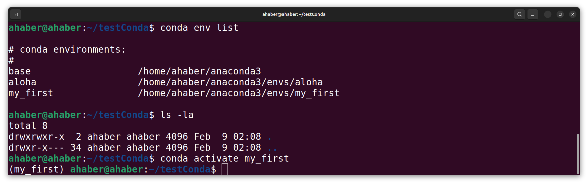

上图为执行 `conda env list` 后的典型输出效果。注意带有 `*` 号的行表示当前激活的环境，每个环境都有独立的安装路径，互不干扰。

**💡 实战演示：创建一个数据分析专用环境**

```bash
# 创建一个名为"数据分析"的虚拟环境，使用 Python 3.10
conda create -n 数据分析 python=3.10

# 激活刚刚创建的环境
conda activate 数据分析

# 在这个环境中安装数据分析常用的包
pip install pandas matplotlib seaborn jupyter
```

激活环境后，你会发现命令行提示符前面多了一个 `(数据分析)` 的前缀——这就是当前环境的"身份标识"，提醒你现在所有操作都在这个隔离的环境中进行。

### 3.2 使用 Conda 安装、更新和卸载软件包


掌握包管理是日常开发中最基础也最频繁的操作。conda 和 pip 都可以安装包，但它们的包仓库不同，各有侧重。

| 操作           | conda 命令                  | pip 命令                       | 说明                                        |
| -------------- | --------------------------- | ------------------------------ | ------------------------------------------- |
| 安装包         | `conda install numpy`       | `pip install numpy`            | 推荐优先用 conda 安装，解决依赖更智能       |
| 指定版本安装   | `conda install pandas=2.0`  | `pip install pandas==2.0.0`    | conda 用 `=`，pip 用 `==`                   |
| 更新包         | `conda update pandas`       | `pip install --upgrade pandas` | 将指定包更新到最新版本                      |
| 卸载包         | `conda remove tensorflow`   | `pip uninstall tensorflow`     | 从当前环境中移除指定包                      |
| 查看已安装的包 | `conda list`                | `pip list`                     | 列出当前环境中所有已安装的包                |
| 搜索包         | `conda search scikit-learn` | `pip search scikit-learn`      | 在仓库中搜索可用的包（pip search 已被禁用） |

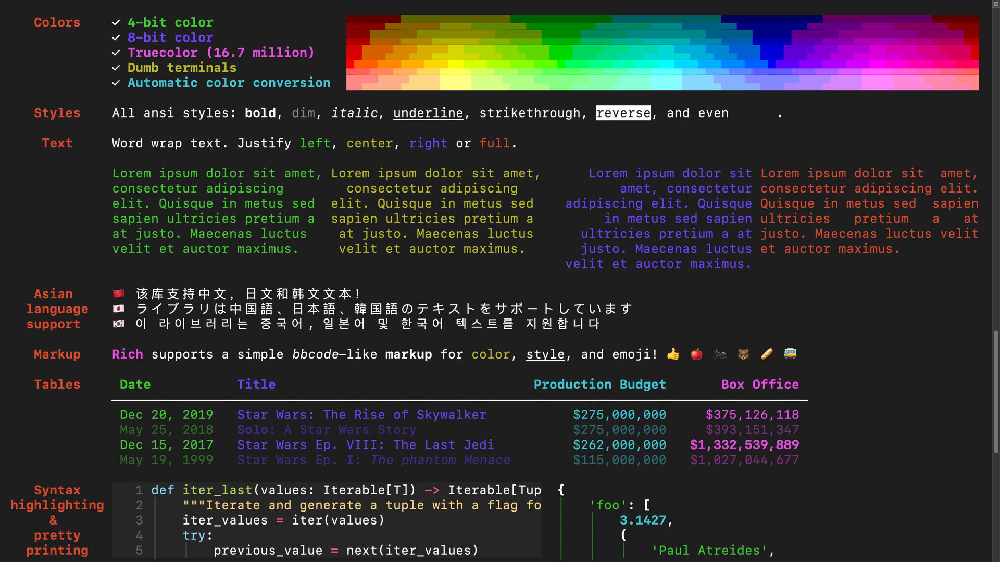

上图为使用 `pip install` 安装包时的典型终端输出，可以看到包的下载、安装和依赖解析过程。

**💡 安装建议：conda 和 pip 该用哪个？**

- **优先使用 conda install**：conda 在安装包时会自动处理依赖关系，避免版本冲突，特别是对于 NumPy、pandas 这类包含 C 扩展的科学计算库，conda 提供了预编译的二进制包，安装更稳定。
- **conda 装不到时再用 pip**：有些包只发布在 PyPI（pip 的仓库）上，conda 仓库里没有，这时候就需要用 `pip install` 来安装。
- **⚠️ 注意**：在同一个环境中混用 conda 和 pip 安装依赖时，偶尔会出现依赖冲突。如果遇到莫名其妙的环境问题，最简单的解决办法是删掉环境重建。

---

## Anaconda 与 Conda 常见问题

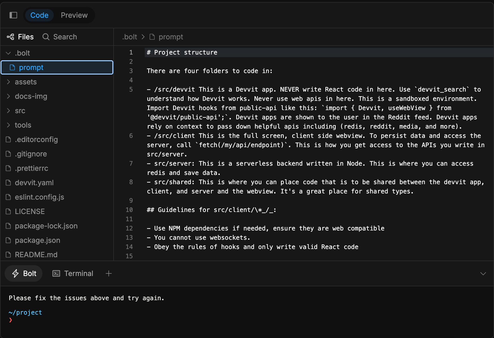

> 遇到问题先别慌，90% 的新手问题都能在下面找到解决方案。

### 问题 1：命令行提示 "conda 不是内部或外部命令"

**原因**：安装时没有勾选 **"Add Anaconda3 to my PATH environment variable"**，或者环境变量没有正确生效。

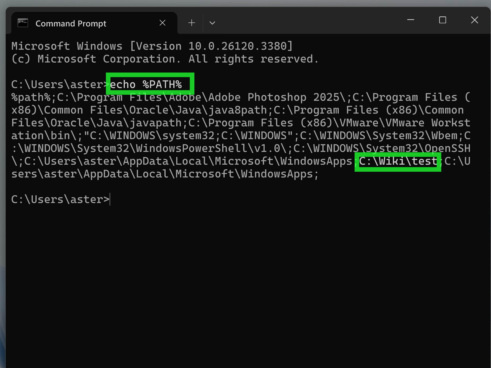

**解决方法——手动添加环境变量：**

1. 找到你的 Anaconda 安装路径（例如 `D:\Anaconda3`）。
2. 右键点击 **"此电脑"** → 选择 **"属性"** → 点击 **"高级系统设置"** → 点击 **"环境变量"**。
3. 在下方的 **"系统变量"** 区域中找到变量名为 **"Path"** 的条目，双击打开编辑。
4. 点击 **"新建"**，依次添加以下 3 个路径（请将 `D:\Anaconda3` 替换为你实际的安装路径）：

```
D:\Anaconda3
D:\Anaconda3\Scripts
D:\Anaconda3\Library\bin
```

5. 一路点击"确定"保存，然后**重启命令行窗口**（或重启电脑）使配置生效。

### 问题 2：换源后下载仍然很慢或报错

**解决步骤：**

1. **清除 conda 缓存**：有时候缓存的旧索引信息会导致问题，执行以下命令清理：

   ```bash
   conda clean -i
   ```

2. **检查配置文件**是否有多余的默认源：
   - Windows：打开 `C:\Users\你的用户名\.condarc`
   - macOS / Linux：打开 `~/.condarc`

   用记事本或任意文本编辑器打开，确保文件中**没有** `defaults` 这一行。如果有的话，删除它并保存。

3. **尝试备用镜像源**——中科大源（当清华源不稳定时使用）：

   ```bash
   conda config --add channels https://mirrors.ustc.edu.cn/anaconda/pkgs/main/
   ```

### 问题 3：创建环境时一直卡在 "Solving environment"

**原因**：conda 在安装包之前需要计算所有依赖关系，确保各个包之间的版本兼容。当环境中包数量多或依赖关系复杂时，这个计算过程可能非常缓慢（新版 conda 的求解器性能有所下降，这是一个已知的痛点）。


上图对比了 mamba 与 conda 在依赖解析速度上的差异——mamba 使用了更高效的求解算法，速度提升非常显著。

**解决方法——安装 mamba 加速器：**

mamba 是 conda 的高性能替代品，使用 C++ 重写的依赖求解引擎，速度比 conda 快 **10-100 倍**。

```bash
# 在 base 环境中安装 mamba
conda install -n base -c conda-forge mamba

# 之后所有 conda 命令都可以用 mamba 替代，语法完全一样：
mamba create -n myenv python=3.11
mamba install pandas numpy
mamba update --all
```

> 💡 **一句话总结**：装完 mamba 后，把日常的 `conda` 命令全部换成 `mamba` 就行，体验会有质的飞跃。

---

## 总结：Anaconda 入门的 3 个核心技能

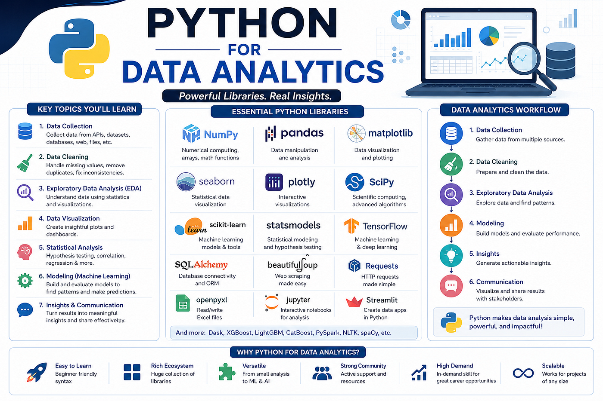

学完这篇教程，你只需要记住以下三个核心能力，就已经超越了 80% 的 Python 新手：

1. **安装并验证 Anaconda**：确保在命令行中输入 `conda --version` 能正常显示版本号，这是所有后续操作的前提。
2. **配置国内镜像源**：记住清华源的配置命令，彻底告别下载慢的困扰——这是国内 Python 开发者的必备技能。
3. **管理虚拟环境**：熟练掌握 `conda create`、`conda activate`、`conda deactivate`、`conda remove` 这四个命令，为不同的项目创建独立的工作空间。

---

## Anaconda 与 Python 学习资源

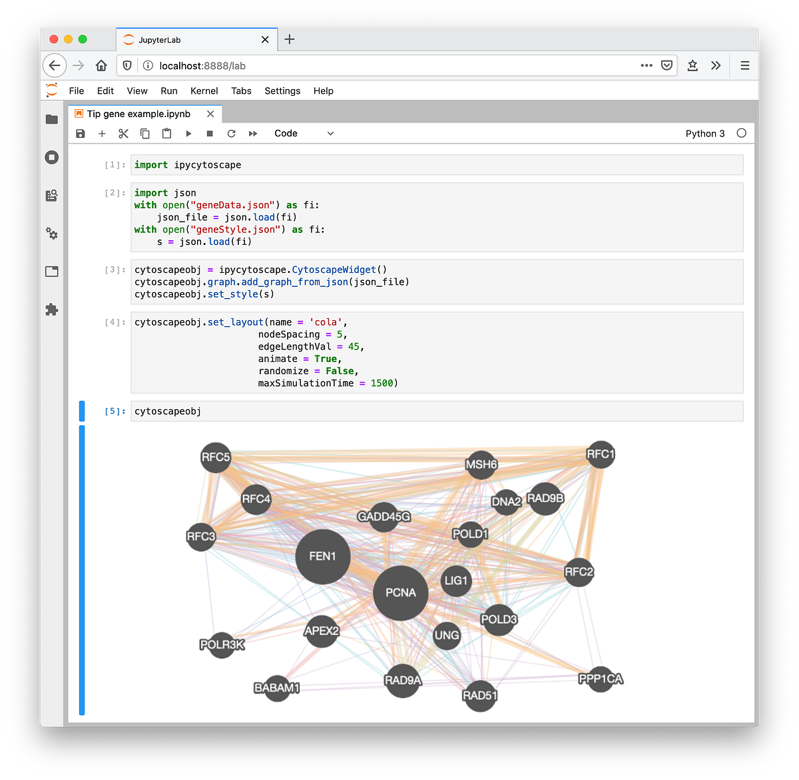

当你掌握了 Anaconda 的基本使用之后，推荐按以下路线继续深入学习：

- **Anaconda 官方文档**（提供中文版）：https://docs.anaconda.com —— 权威且全面的参考资料
- **Jupyter Notebook 入门**：Anaconda 自带了 Jupyter Notebook（如上图所示），它是数据科学领域最流行的交互式编程环境，非常适合边写代码边看结果
- **菜鸟教程 Python 入门**：https://www.runoob.com/python/python-tutorial.html —— 零基础学 Python 语法的优质中文教程
- **Kaggle 实战练习**：https://www.kaggle.com —— 全球最大的数据科学竞赛平台，有大量免费数据集和实战项目可供练习
