> 在完成了 [ArchLinux 基础安装教程](/posts/archinstaller/) 和 [ArchLinux 桌面环境安装配置教程](/posts/archmore/) 之后，你的 Arch Linux 已经具备了完整的日常可用性。但滚动更新发行版的特性决定了：**系统的长期稳定，三分靠安装，七分靠维护**。本指南将带你掌握 Arch 的日常维护基本功与高频故障恢复技巧。


---

## 前言：Arch 维护的三条铁律


1. **不要盲目更新，也不要半年不更**：建议每周或每两周进行一次系统更新，更新前先浏览 Arch 官网新闻。
2. **拒绝部分升级（Partial Upgrade）**：永远使用完整系统升级，不要在更新软件列表后只升级单个包。
3. **出事先看日志，常备 Live USB**：遇到问题不要慌，Live USB + `arch-chroot` 是你的终极后盾。

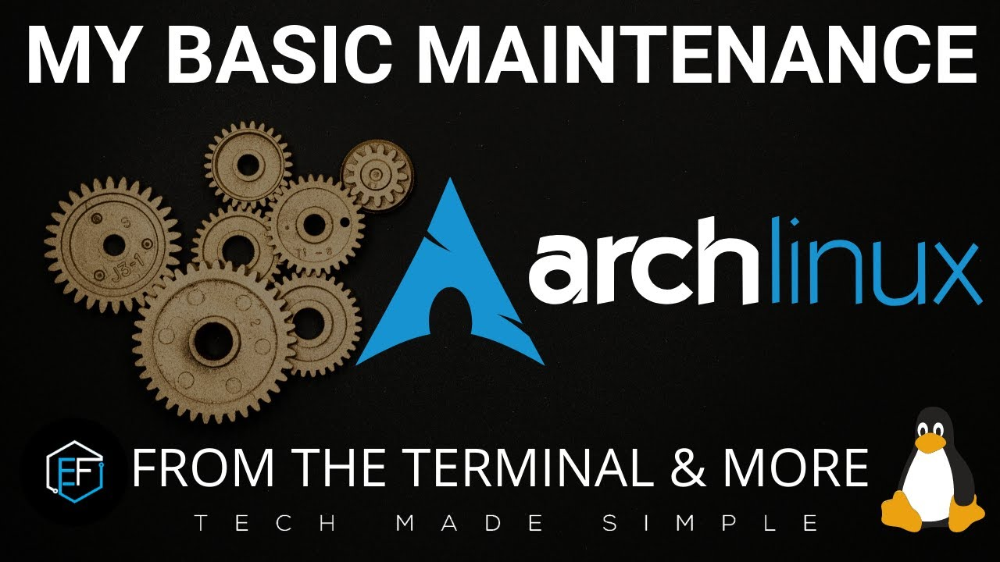

---

## 一、日常更新与 pacman 基本功


### 1. 唯一推荐的更新方式

在 Arch Linux 中，更新系统的标准命令是：

```bash
sudo pacman -Syu
```

**命令参数说明**：
- `-S`: 同步模式（Sync）
- `-y`: 刷新远程软件仓库数据库（Refresh）
- `-u`: 升级所有过期的软件包（sysUpgrade）

> ⚠️ **严禁使用 `pacman -Sy <package>` 单独安装软件！**  
> 单独刷新数据库而不升级系统会导致「部分升级（Partial Upgrade）」，新安装的包可能依赖更新的基础库，导致已有程序动态链接断裂甚至系统崩溃。

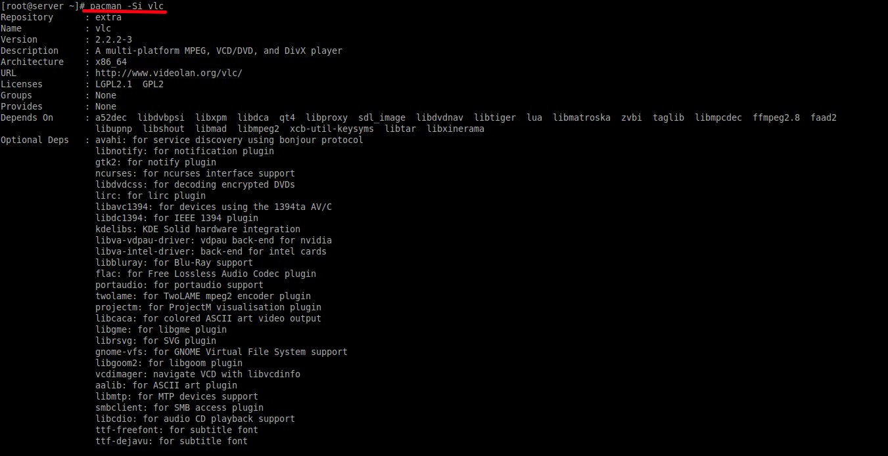

### 2. 清理软件包缓存

pacman 默认会将下载的软件包一直保存在 `/var/cache/pacman/pkg/` 中，不会自动删除旧版本，方便你在需要时降级。但时间久了会大量占用磁盘空间。

推荐安装并使用 `pacman-contrib` 提供的 `paccache` 工具：

```bash
sudo pacman -S pacman-contrib
```

保留最近的 2 个版本并删除其余缓存：

```bash
paccache -rk2
```

如果想使用 pacman 原生命令清理未安装包的缓存：

```bash
sudo pacman -Sc
```

> ⚠️ **避免使用 `pacman -Scc`**，它会清空所有缓存包，使你失去离线降级软件的能力。

### 3. 清理孤立包（Orphans）

当某个软件被卸载后，其依赖项可能仍然残留在系统中（孤立包）。

先检查当前有哪些孤立包：

```bash
pacman -Qtdq
```

确认无误后，一键级联清理：

```bash
sudo pacman -Rns $(pacman -Qtdq)
```

**参数说明**：
- `-R`: 移除软件包
- `-n`: 连同备份的配置文件一起删除
- `-s`: 级联删除不再被其他包依赖的依赖项

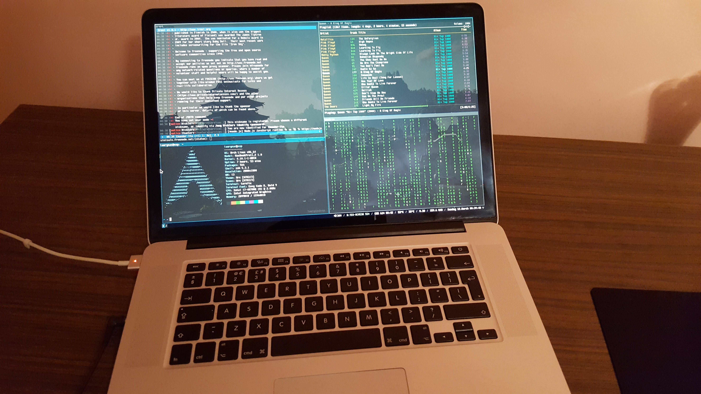

---

## 二、系统健康检查清单

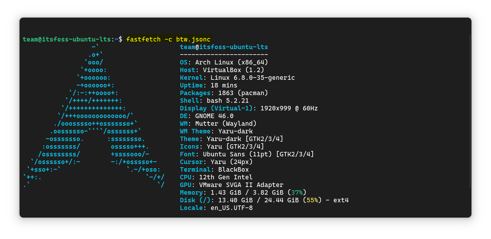

### 1. 检查启动错误日志

每次开机后，可以通过 `systemd` 日志查看是否有严重报错：

```bash
# 查看本次启动以来的所有错误（优先级 err 及以上）
journalctl -b -p err
```

如果日志过多占用空间，可以限制 journal 日志大小：

```bash
sudo journalctl --vacuum-size=200M
```

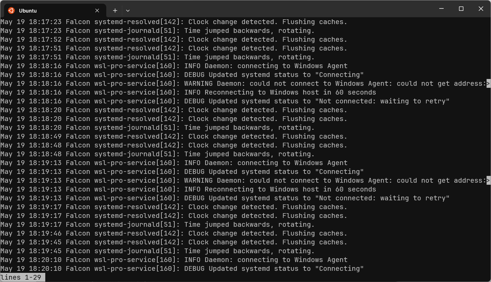

### 2. 查看崩溃或失败的系统服务

```bash
systemctl --failed
```

如果有服务处于 `failed` 状态，使用 `systemctl status <service_name>` 查看具体原因，或用 `journalctl -u <service_name>` 排查。

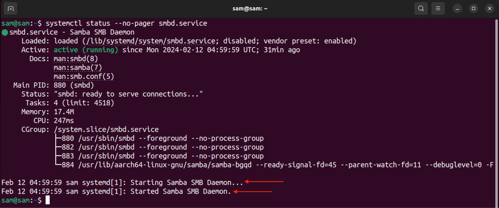

### 3. 时间同步检查

时间不同步会导致 HTTPS 证书校验失败、pacman 签名报错等诡异问题：

```bash
timedatectl status
```

如果 NTP 未激活，开启 systemd 内置的时间同步服务：

```bash
sudo systemctl enable --now systemd-timesyncd
```

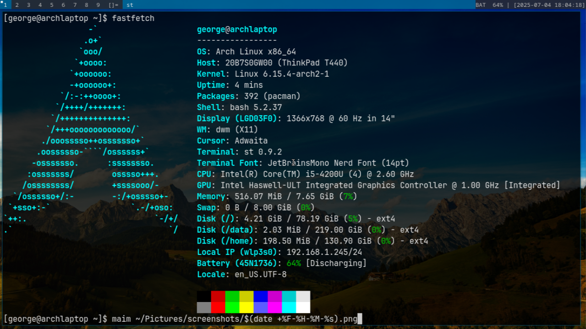

---

## 三、pacman 常见报错与修复


### 1. 数据库被锁定：`unable to lock database`

**错误现象**：
```
error: failed to init transaction (unable to lock database)
error: could not lock database: File exists
```

**原因**：上一次 pacman 被强制中断（例如按了 Ctrl+C 或断电），残留了锁文件。

**解决步骤**：
1. 先确认当前没有 pacman 相关进程在运行：
   ```bash
   pgrep pacman
   ```
2. 若没有任何输出，安全删除锁文件：
   ```bash
   sudo rm /var/lib/pacman/db.lck
   ```

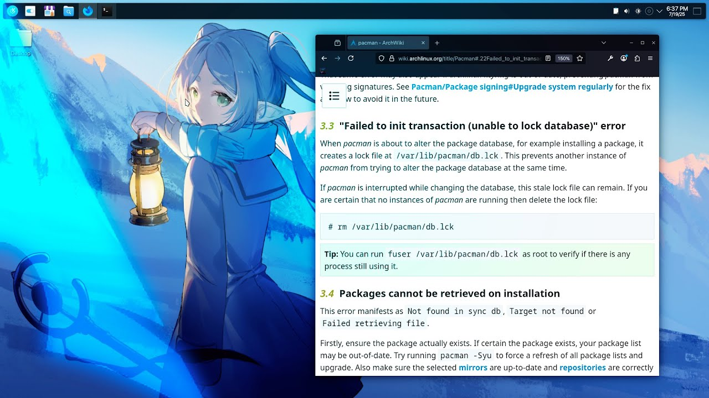

### 2. 密钥环错误：`PGP signature invalid` / `key could not be imported`

**原因**：Arch Linux 开发者公钥更新，本地 `archlinux-keyring` 过旧导致签名验证失败。

**解决步骤**：

```bash
# 1. 优先单独升级密钥环包
sudo pacman -Sy archlinux-keyring && sudo pacman -Su

# 2. 如果依然报错，重置本地密钥数据库
sudo rm -rf /etc/pacman.d/gnupg
sudo pacman-key --init
sudo pacman-key --populate archlinux
```

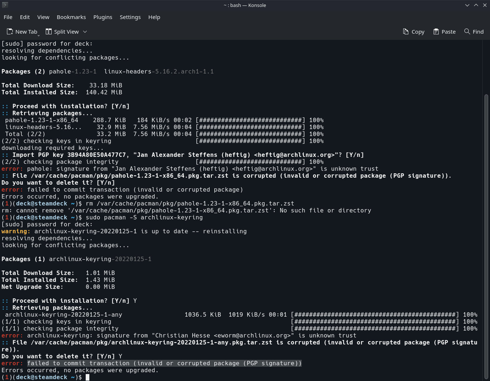

### 3. 文件冲突：`file exists in filesystem`

**错误现象**：
```
error: failed to commit transaction (conflicting files)
package: /usr/bin/xxx exists in filesystem
```

**解决步骤**：
1. 检查该文件是否属于某个已安装的软件包：
   ```bash
   pacman -Qo /usr/bin/xxx
   ```
2. 如果提示 `No package owns /usr/bin/xxx`，说明是之前手动编译或第三方脚本残留的文件。
3. 确认无重要数据后，可让 pacman 覆盖该文件：
   ```bash
   sudo pacman -S <package_name> --overwrite "/usr/bin/xxx"
   ```

---

## 四、内核升级与引导故障恢复

### 1. 升级后黑屏：回退备用内核

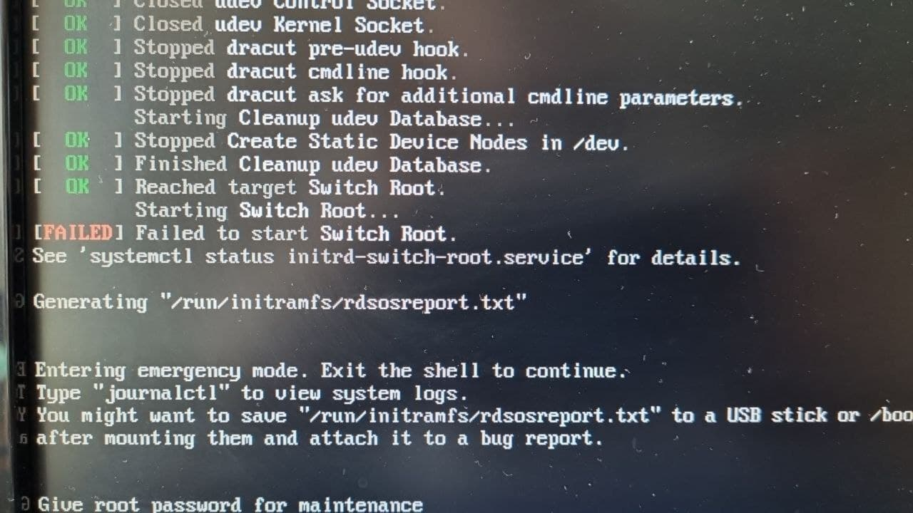

如果你在安装时配置了 `linux-lts` 长期支持版内核，遇到新内核驱动冲突（常见于 NVIDIA 显卡用户）时：

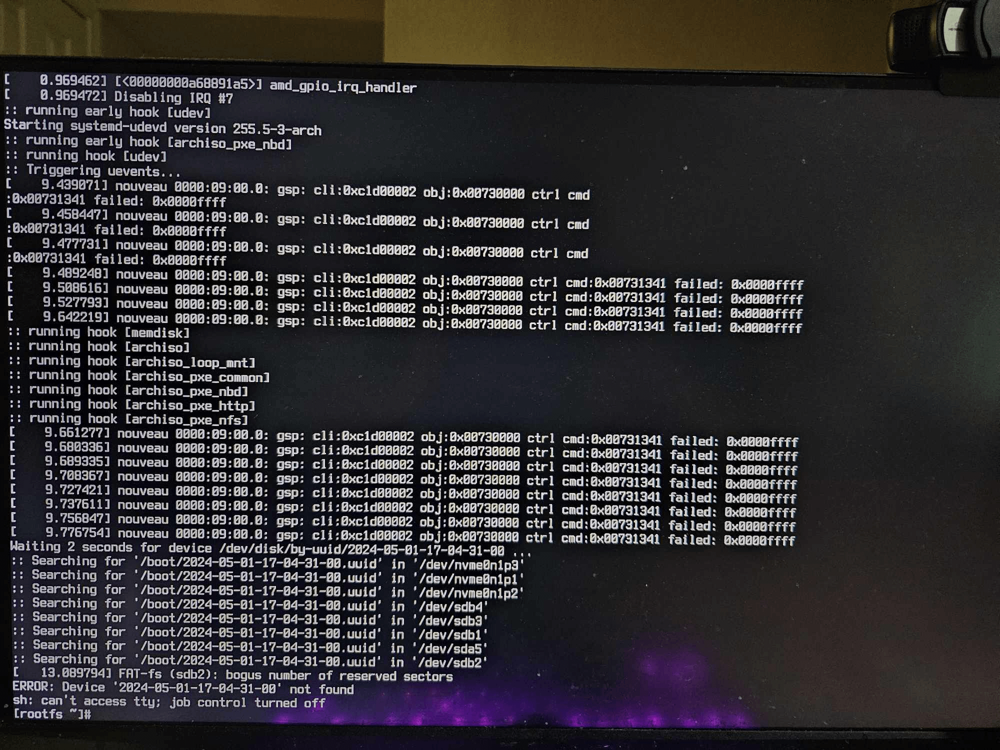

1. 开机在 GRUB 界面选择 **Advanced options for Arch Linux**。
2. 选择 **Linux LTS** 内核启动。
3. 进入系统后重新生成 initramfs 或排查驱动：
   ```bash
   sudo mkinitcpio -P
   ```

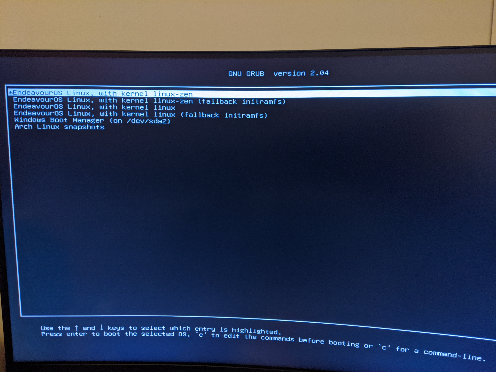

> 💡 **新手建议**：平时至少安装两个内核（`linux` 与 `linux-lts`），并在更新后不要立即重启，确认没有报错再重启。

### 2. 引导损坏：从 Live USB 执行 arch-chroot 修复

如果系统彻底无法进入引导界面，插上安装 U 盘启动：

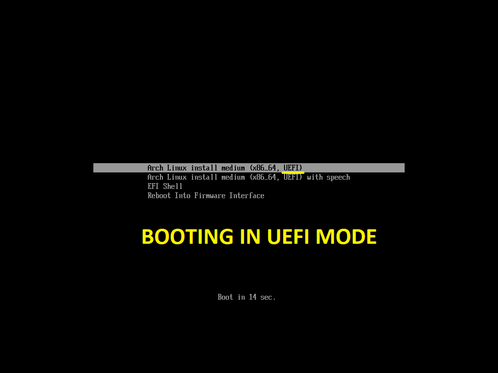

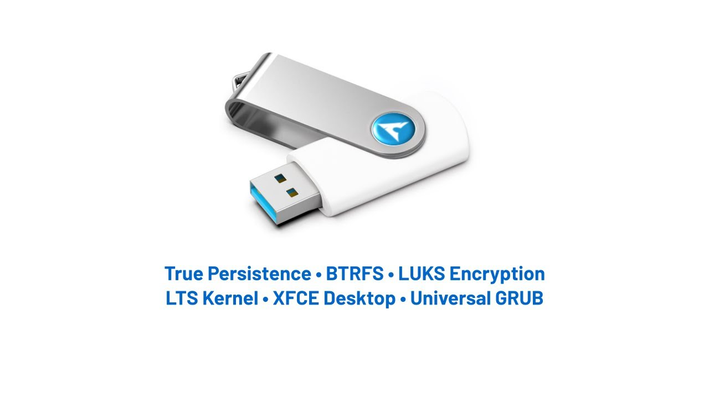

```bash
# 1. 查看分区情况
lsblk

# 2. 挂载根分区（以 btrfs 或 ext4 为例）
# 如果是 ext4:
mount /dev/nvme0n1p2 /mnt

# 3. 挂载 EFI 分区
mount /dev/nvme0n1p1 /mnt/boot

# 4. 进入系统的 chroot 环境
arch-chroot /mnt

# 5. 重新安装并更新 GRUB
grub-install --target=x86_64-efi --efi-directory=/boot --bootloader-id=GRUB
grub-mkconfig -o /boot/grub/grub.cfg

# 6. 重建 initramfs
mkinitcpio -P

# 7. 退出并重启
exit
umount -R /mnt
reboot
```

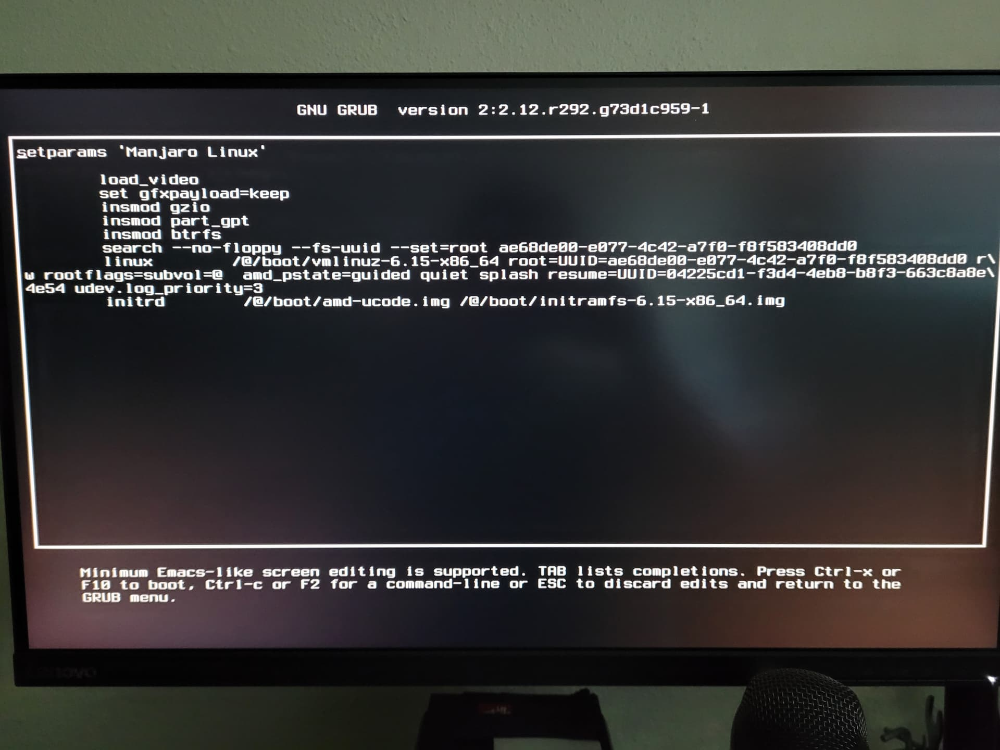

---

## 五、AUR 与第三方包管理

如果你使用的是 `yay` 或 `paru` 等 AUR 助手：


### 1. 完整升级（官方源 + AUR）

```bash
yay -Syu
```

### 2. 清理 AUR 编译构建残留

AUR 包在编译时会在 `~/.cache/yay/` 产生大量源码和中间文件：

```bash
# 清理无用的构建依赖与缓存
yay -Yc
yay -Sc
```

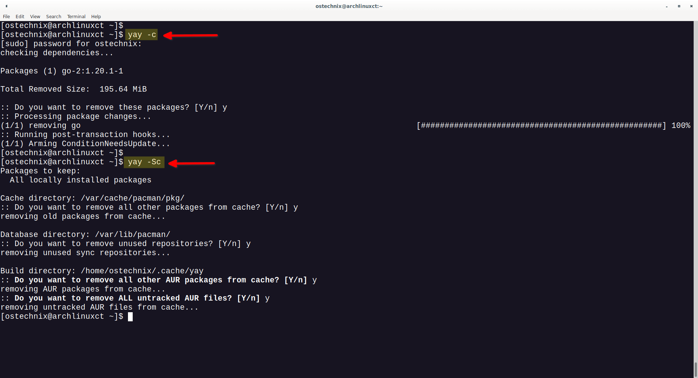

### 3. AUR 包编译报错

- 检查是不是缺少 `base-devel` 元包：`sudo pacman -S --needed base-devel`
- 查看 AUR 页面评论区（Pin comment），通常已有用户给出当前版本的补丁或解决方法。


---

## 六、维护速查表

| 场景 | 命令 | 说明 |
| :--- | :--- | :--- |
| **日常更新** | `sudo pacman -Syu` | 官方源全量升级 |
| **AUR更新** | `yay -Syu` | 官方 + AUR 一并升级 |
| **清理缓存** | `paccache -rk2` | 保留最近 2 个版本缓存 |
| **清理孤立包** | `sudo pacman -Rns $(pacman -Qtdq)` | 卸载不再被依赖的包 |
| **查看错误日志** | `journalctl -b -p err` | 查看本次开机严重错误 |
| **解锁数据库** | `sudo rm /var/lib/pacman/db.lck` | 清除异常退出的锁文件 |
| **修复密钥环** | `sudo pacman-key --populate archlinux` | 重新载入官方签名公钥 |
| **重建 initramfs** | `sudo mkinitcpio -P` | 为所有内核重新生成引导映像 |
| **更新 GRUB 配置** | `sudo grub-mkconfig -o /boot/grub/grub.cfg` | 重新扫描并生成启动菜单 |

---

## 结语

使用 Arch Linux 的核心在于建立良好的维护习惯。只要坚持**完整更新**、**不乱用覆盖安装**，并在关键更新前做好快照（推荐参考 [Btrfs 快照 + 备份方案实战：打造永不丢数据的 Linux 系统](/posts/btrfs-snapshot-backup-guide/)），你的 Arch 系统就能长期平稳运行，远离「滚挂」的烦恼。

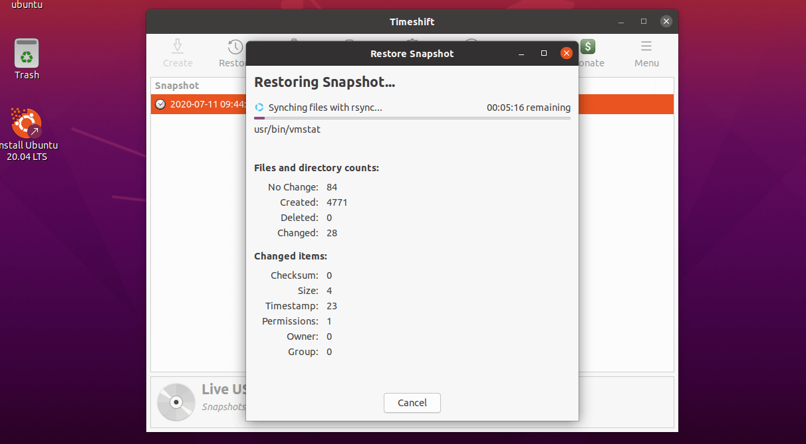

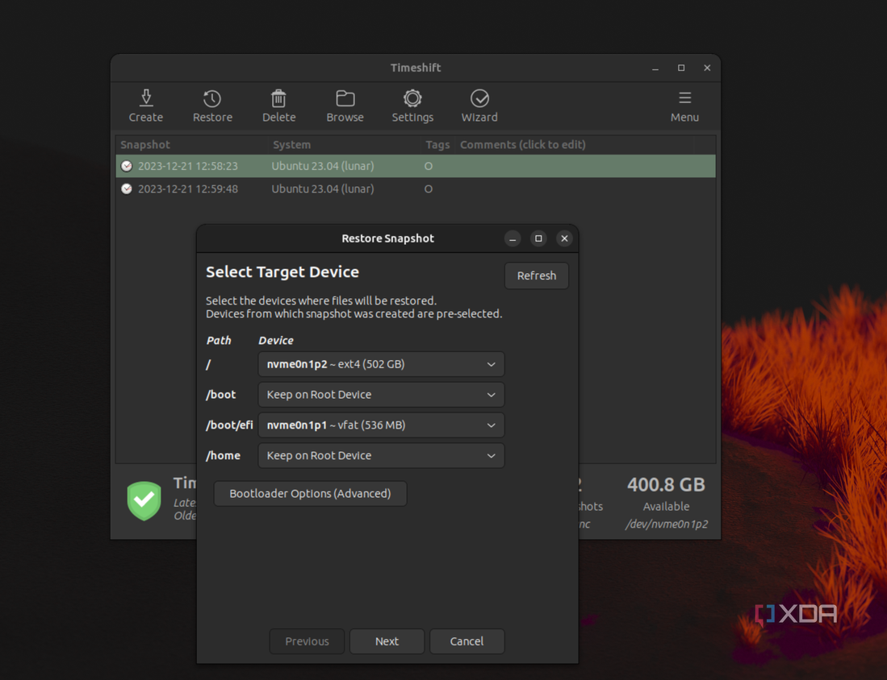
