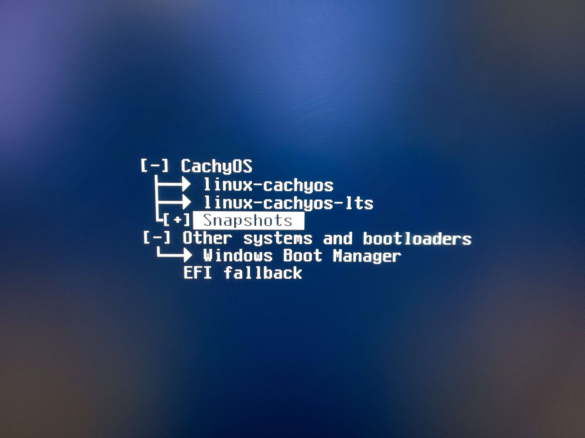
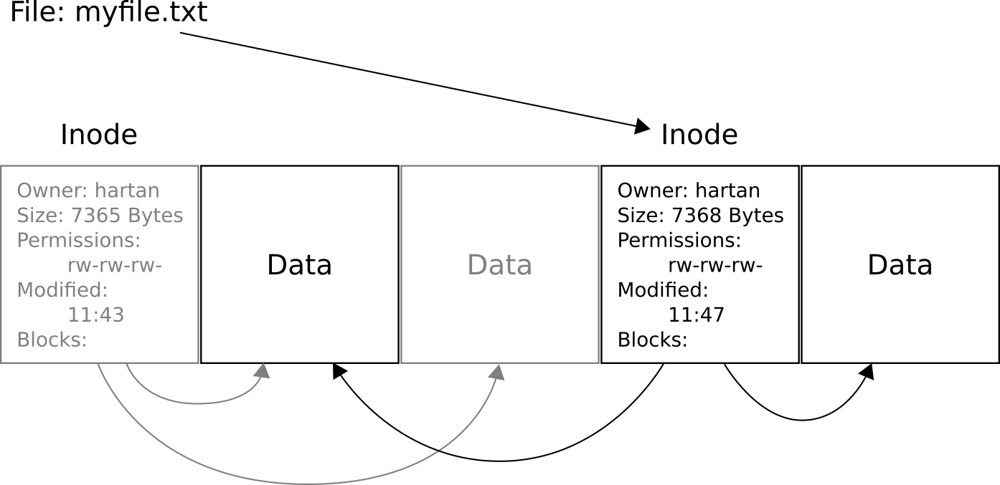
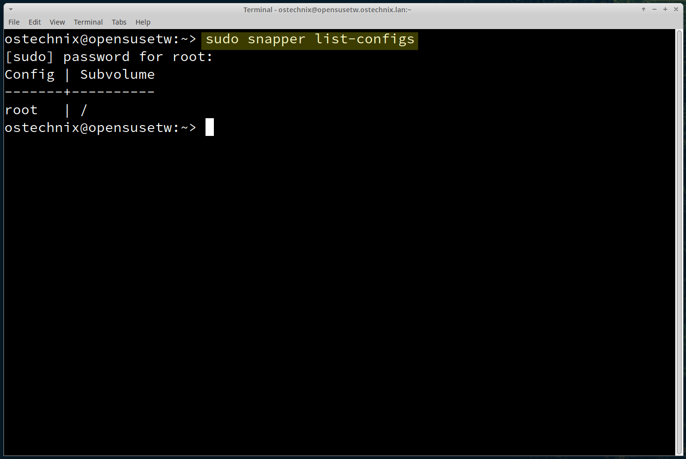
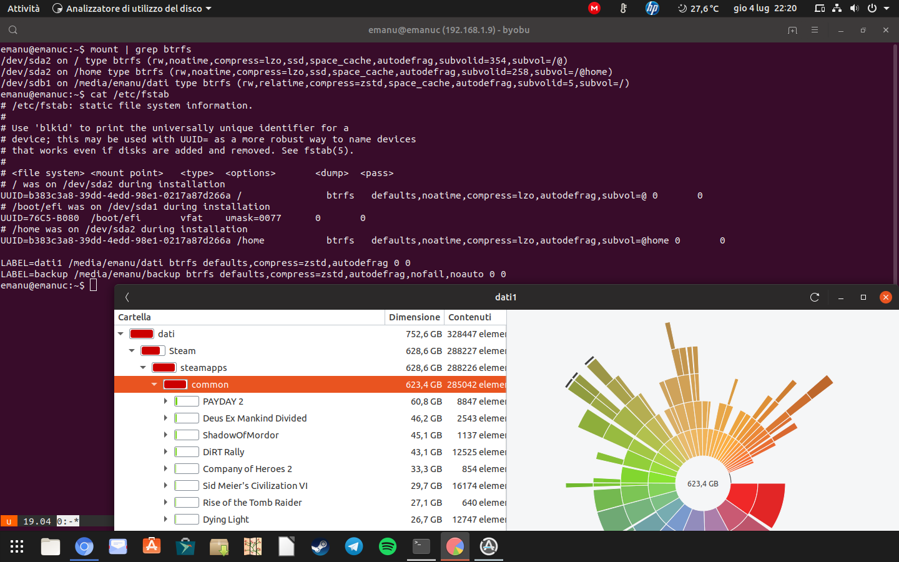
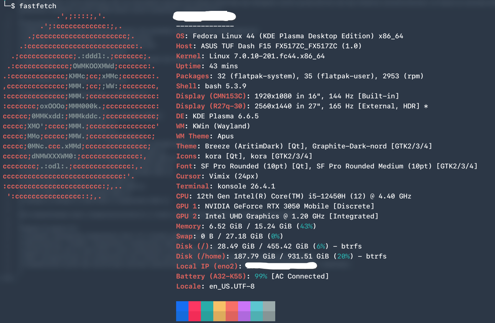
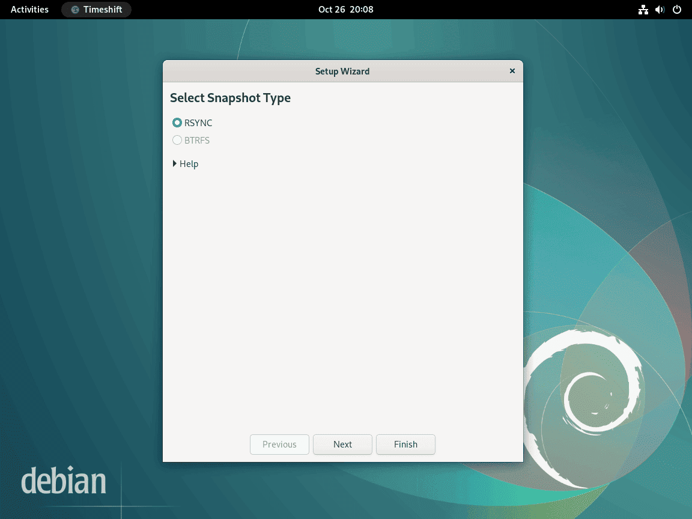
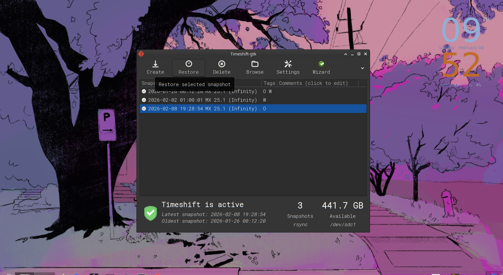
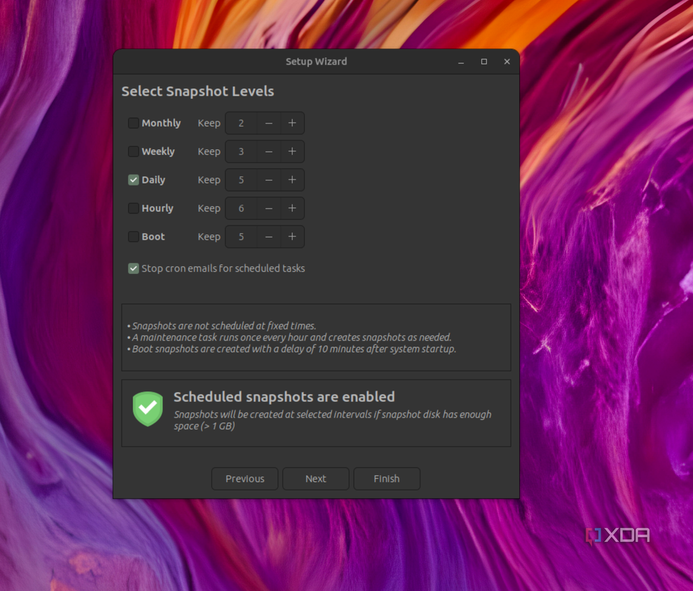
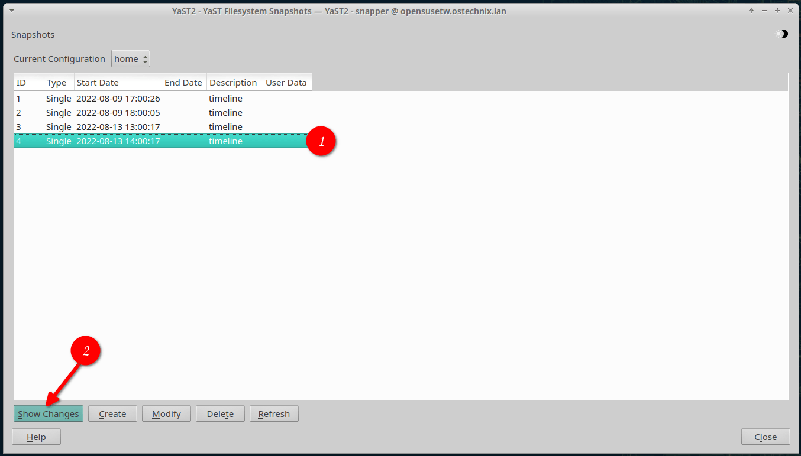
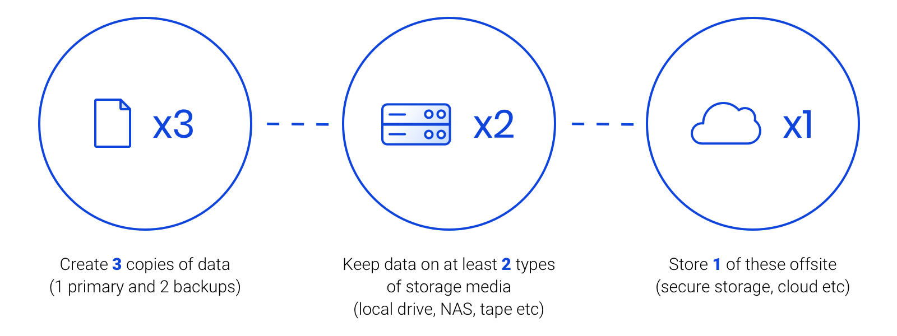

## 前言



> _"rm -rf / 这种事，我再也不想经历第二次了。"_

如果你用过 Linux 足够久，大概率遇到过这些场景：系统更新后显卡驱动挂了、手滑删了重要文件、某个软件包升级导致整个桌面环境崩溃。传统的备份方案要么**速度太慢**（`rsync` 全量同步），要么**恢复太麻烦**（重装系统 + 逐步恢复数据）。

**Btrfs 快照**提供了一种优雅的解决方案：它基于 **Copy-on-Write（写时复制）** 机制，创建快照几乎是**瞬间完成**的，且初始几乎**不占用额外空间**。结合 `btrbk` 和 `Timeshift` 等工具，我们可以搭建一套**全自动、增量、可远程传输**的备份系统。

本文将从 **Btrfs 基础概念**出发，逐步带你完成：

1. ✅ Btrfs 子卷与快照的基本操作
2. ✅ 使用 **Timeshift** 实现系统快照 + 一键回滚
3. ✅ 使用 **btrbk** 实现自动化增量备份（本地 + 远程）
4. ✅ 配置 **定时任务**实现无人值守备份
5. ✅ 灾难恢复实操演练

---

## 一、为什么选择 Btrfs？

### 1.1 Btrfs 核心优势

Btrfs（B-Tree Filesystem）是 Linux 内核自带的**现代文件系统**，被称为"Linux 的 ZFS"。它的核心特性包括：

| 特性                          | 说明                                   | 对备份的意义               |
| :---------------------------- | :------------------------------------- | :------------------------- |
| **CoW（写时复制）**           | 修改文件时不覆盖原数据，而是写入新位置 | 快照瞬间完成，不复制数据   |
| **快照（Snapshot）**          | 捕获子卷在某一时刻的完整状态           | 系统回滚、误删恢复         |
| **子卷（Subvolume）**         | 将文件系统划分为多个独立子卷           | 灵活管理不同目录的备份策略 |
| **压缩**                      | 支持 zstd、lzo、zlib 压缩              | 节省备份存储空间           |
| **校验和**                    | 对所有数据计算 checksum                | 检测数据静默损坏           |
| **发送/接收（Send/Receive）** | 增量传输快照差异                       | 高效远程备份               |

### 1.2 Btrfs vs ext4 vs ZFS

| 特性      |    Btrfs     | ext4 |       ZFS       |
| :-------- | :----------: | :--: | :-------------: |
| 快照      |      ✅      |  ❌  |       ✅        |
| 内核原生  |      ✅      |  ✅  |  ❌（需 DKMS）  |
| 压缩      |      ✅      |  ❌  |       ✅        |
| 发送/接收 |      ✅      |  ❌  |       ✅        |
| RAID 5/6  | ⚠️（实验性） |  ❌  |       ✅        |
| 学习曲线  |     中等     |  低  |       高        |
| 适合场景  |  桌面/单盘   | 通用 | 大型存储/服务器 |

> **总结**：对于桌面 Linux 用户和 homelab 玩家，Btrfs 是快照备份的最佳选择——内核原生支持、配置简单、快照功能强大。



_Copy-on-Write 的核心思想：修改数据时，先将原始数据块保留（快照可继续引用），再将新数据写入新位置。这就是 Btrfs 快照几乎不占空间的秘密。_

---

## 二、Btrfs 基础：子卷与快照

### 2.1 查看当前文件系统

```bash
# 查看文件系统类型
df -Th

# 查看 Btrfs 文件系统信息
sudo btrfs filesystem show

# 查看子卷列表
sudo btrfs subvolume list /
```

输出示例：

```
ID 256 gen 12345 top level 5 path @
ID 257 gen 12345 top level 5 path @home
ID 258 gen 12345 top level 5 path @var
ID 259 gen 12345 top level 5 path @snapshots
ID 260 gen 12345 top level 5 path @cache
```

> **说明**：常见的子卷命名约定中，`@` 代表系统根目录，`@home` 代表用户数据，`@snapshots` 用于存放快照。**Fedora** 和 **openSUSE** 默认使用这种布局。



_执行 `btrfs subvolume list /` 后可以看到系统中所有子卷的 ID、世代号和路径。上图是一个实际系统中子卷列表的终端输出。_

### 2.2 手动创建快照



_在操作快照之前，先用 `mount | grep btrfs` 确认子卷已正确挂载，检查 `/etc/fstab` 中的 Btrfs 挂载配置是否包含 `subvol=` 参数。_

```bash
# 创建快照（读写快照）
sudo btrfs subvolume snapshot / @snapshots/manual-$(date +%Y%m%d-%H%M%S)

# 创建只读快照（推荐，防止误修改）
sudo btrfs subvolume snapshot -r / @snapshots/readonly-$(date +%Y%m%d-%H%M%S)

# 查看所有快照
sudo btrfs subvolume list -s /
```

### 2.3 快照的"魔法"

Btrfs 快照之所以**几乎不占空间**，是因为它只记录了对原数据的**引用**。只有当你修改了原文件系统中对应的数据块时，快照才会"继承"被替换的旧数据块。

举个例子：

```bash
# 创建快照前
sudo btrfs filesystem df /
# Data, single: 15.00GiB

# 创建只读快照
sudo btrfs subvolume snapshot -r / @snapshots/before-update

# 创建快照后（几乎没变化！）
sudo btrfs filesystem df /
# Data, single: 15.01GiB  ← 仅增加了元数据
```



_系统监视器中可以看到根分区和 /home 分区均使用 Btrfs 文件系统。创建快照后你可以用 `btrfs filesystem df /` 观察到数据量几乎没有变化。_

---

## 三、Timeshift：系统快照的"时光机"

### 3.1 安装 Timeshift



**Timeshift** 是 Btrfs 快照的 GUI 管理工具，提供了直观的快照管理界面和定时自动快照功能。

```bash
# Arch Linux
sudo pacman -S timeshift

# Fedora
sudo dnf install timeshift

# Ubuntu / Debian
sudo apt install timeshift
```

### 3.2 初始配置

首次启动 Timeshift 后，按以下步骤配置：

1. **选择快照类型**：选择 **Btrfs 快照**（而非 rsync）
2. **选择快照位置**：选择你的 Btrfs 根分区
3. **配置定时计划**：

| 快照类型 | 保留数量 | 说明                    |
| :------- | :------: | :---------------------- |
| 每日快照 |    3     | 保留最近 3 天的每日快照 |
| 每周快照 |    2     | 保留最近 2 周的每周快照 |
| 每月快照 |    0     | 按需开启                |

4. **排除规则**（可选）：
   - 排除下载目录：`/home/用户名/Downloads`
   - 排除缓存：`/home/用户名/.cache`
   - 排除容器数据：`/var/lib/containers`

### 3.3 手动创建与恢复快照

**创建快照**：

```bash
# 命令行创建（带标签）
sudo timeshift --create --comments "安装 NVIDIA 驱动前"
# Created successful snapshot at /timeshift-btrfs/snapshots/2026-07-05_14-00-00/

# 列出所有快照
sudo timeshift --list
```

**恢复快照**：

```bash
# 命令行恢复
sudo timeshift --restore --snapshot "2026-07-05_14-00-00"

# 或使用 GUI 恢复（推荐，更直观）
sudo timeshift-gtk
```



_Timeshift 主界面展示了所有快照的时间线列表，选中某个快照后点击「Restore」按钮即可开始恢复。右侧显示该快照的详细信息和包含的文件。_

> ⚠️ **注意**：恢复系统快照时，**不要在运行中的系统上直接恢复根分区**。建议从 Live USB 启动后再执行恢复操作，或使用 Timeshift 的 GRUB 集成功能在启动时选择快照。

### 3.4 GRUB 集成：开机选快照

Timeshift 支持将快照注册到 GRUB 引导菜单，实现**开机时直接选择快照启动**：

```bash
# 启用 GRUB 集成
sudo timeshift --create --comments "启用GRUB集成前"
sudo grub-mkconfig -o /boot/grub/grub.cfg
```

重启后，你会在 GRUB 菜单中看到 Timeshift 快照条目，选择后即可从该快照引导系统。



_在快照管理工具的设置界面中，可以选择需要启用的快照级别（如每小时、每日、每周、每月）。不同级别的快照保留策略不同，可以根据磁盘空间灵活调整。_

### 3.5 最佳实践

> 💡 **我推荐的 Timeshift 使用策略**：
>
> - ✅ 每日自动快照，保留 **3 份**
> - ✅ 每周自动快照，保留 **2 份**
> - ✅ 系统大更新前**手动创建**带标签的快照
> - ✅ 排除大文件目录（Downloads、.cache、容器数据）
> - ✅ 启用 GRUB 集成，确保系统挂了也能恢复

---

## 四、btrbk：专业的增量备份方案

Timeshift 解决了**本地系统快照**的问题，但如果硬盘坏了怎么办？我们需要把快照**备份到外部存储**——这就是 **btrbk** 的用武之地。

### 4.1 btrbk 是什么？

**btrbk** 是一个专为 Btrfs 设计的备份工具，核心功能包括：

- 📸 **自动化快照管理**：按计划创建和清理快照
- 📡 **增量传输**：使用 `btrfs send/receive` 只传输变化的数据
- 🔁 **本地 + 远程备份**：支持 SSH 远程备份到另一台机器
- 🧹 **自动清理**：按保留策略自动删除过期快照
- 📋 **邮件通知**：备份完成后发送报告

### 4.2 安装 btrbk

```bash
# Arch Linux
sudo pacman -S btrbk

# Fedora
sudo dnf install btrbk

# 其他发行版（从源码编译）
git clone https://github.com/digint/btrbk.git
cd btrbk
sudo make install
```

### 4.3 核心概念

在配置 btrbk 之前，需要理解几个概念：

- **Volume（卷）**：Btrfs 挂载点，包含多个子卷
- **Subvolume（子卷）**：需要备份的目录单元
- **Target（目标）**：备份存储位置（本地路径或远程 SSH）
- **Snapshot（快照）**：btrbk 自动创建的临时快照
- **Archive（归档）**：备份目标上的快照副本
- **Send/Receive**：Btrfs 原生的增量传输机制

> **`btrfs send/receive` 的工作原理**：首次传输时会发送完整的快照数据，后续传输只发送两个快照之间的**差异部分**（增量）。这意味着如果每天只有 1GB 数据变化，即使系统总量是 100GB，每天也只需传输约 1GB。

### 4.4 本地备份配置

假设你的系统布局如下：

```
/ (Btrfs 根分区, 挂载点 /)
├── @          (系统根, 挂载在 /)
├── @home      (用户数据, 挂载在 /home)
└── @snapshots (快照存储, 挂载在 /.snapshots)

/dev/sdb1 (外置硬盘, 挂载在 /mnt/backup)
```

创建配置文件：

```bash
sudo mkdir -p /etc/btrbk
sudo nvim /etc/btrbk/btrbk.conf
```

**`/etc/btrbk/btrbk.conf` 配置**：

```ini
# /etc/btrbk/btrbk.conf

# === 全局设置 ===
# 事务日志位置
transaction_logfile /var/log/btrbk.log

# 锁文件防止重复运行
lockfile /run/lock/btrbk.lock

# 压缩传输（使用 zstd）
preserve_children    no
snapshot_dir         .btrbk_snapshots

# === 卷配置 ===
volume /
  # 备份 @home 子卷
  subvolume @home
    snapshot_create   always
    target            /mnt/backup/home
    target_preserve   hourly 24   # 保留 24 个每小时快照
    target_preserve   daily  7    # 保留 7 个每日快照
    target_preserve   weekly 4    # 保留 4 个每周快照
    target_preserve   monthly 6   # 保留 6 个每月快照

  # 备份 @ (系统根) 子卷
  subvolume @
    snapshot_create   always
    target            /mnt/backup/root
    target_preserve   daily  7
    target_preserve   weekly 4
    target_preserve   monthly 3
```

### 4.5 远程备份配置（通过 SSH）

如果你有另一台 Linux 机器（比如 NAS 或 VPS），可以通过 SSH 实现远程备份：

**`/etc/btrbk/btrbk.conf`（添加远程目标）**：

```ini
# === 远程备份 ===
volume /
  subvolume @home
    snapshot_create   always
    target            ssh://user@nas.local/backup/btrbk/home
    target_preserve   daily  14
    target_preserve   weekly 8
    target_preserve   monthly 12

  subvolume @
    snapshot_create   always
    target            ssh://user@nas.local/backup/btrbk/root
    target_preserve   daily  7
    target_preserve   weekly 4
```

**SSH 密钥配置**（避免每次输入密码）：

```bash
# 生成密钥
ssh-keygen -t ed25519 -C "btrbk-backup"

# 复制到远程机器
ssh-copy-id user@nas.local

# 测试连接
ssh user@nas.local "echo OK"
```

### 4.6 运行备份

```bash
# 干运行（查看会执行什么操作，不实际执行）
sudo btrbk -n -v run

# 实际运行
sudo btrbk run

# 查看备份状态
sudo btrbk list
```

**输出示例**：

```
BACKUP PARAMETERS
--------------------------------------------------------------
Source Volume      : /
Source Subvolume   : @home
Target Type       : local
Target Directory  : /mnt/backup/home
Snapshot Directory: .btrbk_snapshots

SNAPSHOTS ON SOURCE (/@home)
--------------------------------------------------------------
2026-07-05_14.00.00    (latest)

ARCHIVES ON TARGET (/mnt/backup/home)
--------------------------------------------------------------
2026-07-01_14.00.00    daily
2026-07-02_14.00.00    daily
2026-07-03_14.00.00    daily
2026-07-04_14.00.00    daily
2026-07-05_14.00.00    daily  (latest)
```

---

## 五、定时任务：实现全自动备份

### 5.1 配置 systemd 定时器

btrbk 自带 systemd 服务文件，可以直接启用：

```bash
# 启用每小时自动备份
sudo systemctl enable --now btrbk-hourly.timer

# 启用每日自动备份
sudo systemctl enable --now btrbk-daily.timer

# 查看定时器状态
systemctl list-timers btrbk-*
```

**自定义定时器**（如果需要更灵活的调度）：

```ini
# /etc/systemd/system/btrbk-custom.timer
[Unit]
Description=Run btrbk backup custom schedule

[Timer]
OnCalendar=*-*-* 06,12,18,23:00:00
Persistent=true

[Install]
WantedBy=timers.target
```

```ini
# /etc/systemd/system/btrbk-custom.service
[Unit]
Description=Btrbk custom backup

[Service]
Type=oneshot
ExecStart=/usr/bin/btrbk run -v
Nice=19
IOSchedulingClass=idle
```

```bash
sudo systemctl daemon-reload
sudo systemctl enable --now btrbk-custom.timer
```

### 5.2 日志与监控

```bash
# 查看最近备份日志
sudo journalctl -u btrbk-hourly.service -n 50

# 查看事务日志
sudo tail -f /var/log/btrbk.log
```

---

## 六、灾难恢复实操

### 6.1 场景一：系统更新后无法启动

**使用 Timeshift GRUB 恢复**：

1. 重启电脑
2. 在 GRUB 菜单中选择 **Timeshift 快照**
3. 选择更新前的快照
4. 恢复完成后重启

**使用 Live USB + btrbk 恢复**：

```bash
# 1. 从 Live USB 启动

# 2. 挂载 Btrfs 根分区
sudo mount /dev/nvme0n1p2 /mnt

# 3. 查看快照
sudo btrfs subvolume list -s /mnt

# 4. 如果 @ 子卷损坏，替换为快照
cd /mnt
sudo mv @ @-broken
sudo btrfs subvolume snapshot @snapshots/2026-07-04_14-00-00 @

# 5. 重启
sudo reboot
```

### 6.2 场景二：误删重要文件

```bash
# 查看快照中的文件
ls @snapshots/2026-07-05_14-00-00/home/username/Documents/

# 恢复单个文件
cp @snapshots/2026-07-05_14-00-00/home/username/Documents/important.pdf \
   /home/username/Documents/
```

### 6.3 场景三：硬盘损坏，从备份恢复

```bash
# 1. 安装新硬盘并格式化为 Btrfs
sudo mkfs.btrfs -L arch /dev/nvme0n1p2

# 2. 挂载
sudo mount /dev/nvme0n1p2 /mnt

# 3. 从外部硬盘恢复
sudo btrbk restore --target /mnt /mnt/backup/root

# 4. 重新生成 GRUB
sudo arch-chroot /mnt
grub-mkconfig -o /boot/grub/grub.cfg
```

---

## 七、进阶技巧

### 7.1 使用 snapper 管理 rolling 快照

**Snapper** 是另一个 Btrfs 快照管理工具，特别适合需要 **TIMELINE 模式**（按时间线自动创建快照）的场景。在 openSUSE 中，Snapper 已深度集成到 YaST 管理工具中：



_openSUSE 的 YaST 文件系统快照管理界面，展示了快照列表、类型（单次/时间线）、创建时间和描述。点击「Show Changes」可以对比快照间的文件差异。_

```bash
# 安装
sudo pacman -S snapper

# 创建配置
sudo snapper -c root create-config /

# Timeline 模式配置
# /etc/snapper/configs/root
TIMELINE_CREATE="yes"
TIMELINE_CLEANUP="yes"
TIMELINE_MIN_AGE="1800"
TIMELINE_LIMIT_HOURLY="5"
TIMELINE_LIMIT_DAILY="7"
TIMELINE_LIMIT_WEEKLY="4"
TIMELINE_LIMIT_MONTHLY="12"
```

### 7.2 Btrfs 压缩节省空间

```bash
# 启用 zstd 压缩（对已有数据也生效）
sudo btrfs filesystem defrag -crz /

# 查看压缩统计
sudo btrfs filesystem show -s /
```

### 7.3 btrbk 邮件通知

在配置文件中添加邮件通知，备份成功或失败时自动发送邮件：

```ini
# /etc/btrbk/btrbk.conf
# 邮件通知（需要配置 postfix 或 msmtp）
email_from    "btrbk@myserver.com"
email_to      "admin@myserver.com"
email_success always
email_error   always
email_syslog  yes
```

---

## 八、常见问题排查

### Q1：快照占用了太多空间怎么办？

```bash
# 查看各子卷的空间使用
sudo btrfs filesystem df /

# 删除不需要的快照
sudo btrfs subvolume delete @snapshots/old-snapshot

# 使用 btrbk 清理
sudo btrbk clean --all
```

### Q2：btrbk 报错 "ERROR: snapshot/create: ..."

通常是因为快照目录不存在或子卷未正确挂载。检查：

```bash
# 确认子卷已挂载
mount | grep btrfs

# 确认快照目录存在
ls -la /.snapshots/  # 或你的 snapshot_dir
```

### Q3：远程备份速度很慢？

```bash
# 启用压缩传输
# 在 /etc/ssh/ssh_config 中添加
Host nas.local
    Compression yes
    CompressionLevel 9
```

### Q4：Timeshift 和 btrbk 可以同时使用吗？

**可以**，但需要注意不要让它们管理同一个快照目录。建议：

- **Timeshift**：管理 `/timeshift-btrfs/snapshots/` 下的系统快照
- **btrbk**：管理 `.btrbk_snapshots/` 下的备份快照

---

## 总结



_上图中展示的多层备份策略正是我们本文实现的方案：本地快照提供即时恢复能力，外置硬盘应对设备故障，远程备份防范物理灾害。_

通过 **Btrfs + Timeshift + btrbk** 的组合，我们构建了一套完整的备份体系：

| 层级             | 工具          | 功能                       | 恢复时间  |
| :--------------- | :------------ | :------------------------- | :-------: |
| **L1：系统快照** | Timeshift     | 系统级回滚，应对更新失败   | < 5 分钟  |
| **L2：增量备份** | btrbk（本地） | 外置硬盘备份，应对硬盘损坏 | < 30 分钟 |
| **L3：远程备份** | btrbk（SSH）  | 异地备份，应对物理灾害     | < 1 小时  |

这套方案的核心优势在于：

- ⚡ **快照瞬间完成**：CoW 机制让你几乎感知不到备份在进行
- 💾 **增量传输**：`btrfs send/receive` 只传输变化的数据块，节省带宽
- 🔄 **全自动运行**：systemd 定时器实现无人值守
- 🛡️ **多层防护**：本地快照 + 外置硬盘 + 远程备份三重保障

数据无价，备份永远不会多余。希望这篇文章能帮你搭建起可靠的 Btrfs 备份体系，让"时光倒流"不再是梦！
