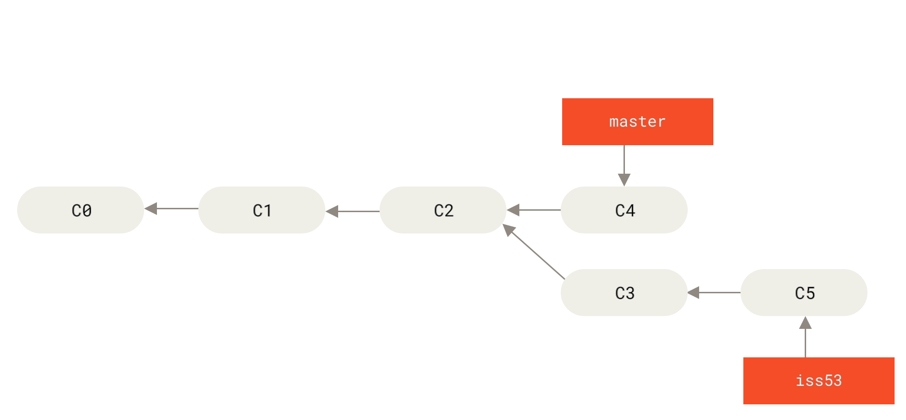
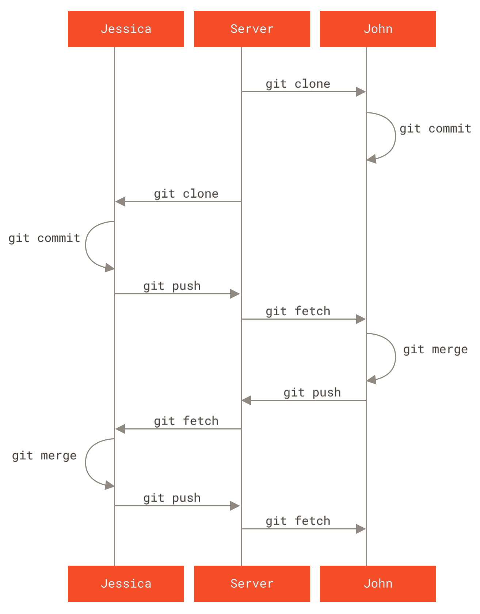

# Git版本控制系统入门与实践指南

在现代软件开发流程中，版本控制系统（Version Control System, VCS）是不可或缺的基础设施。Git作为目前全球最先进的分布式版本控制系统，凭借其卓越的性能和强大的分支管理能力，成为了开发者的标准工具。本文将从核心概念出发，严谨地探讨Git的底层工作逻辑与标准实践流程。

## 1. Git的核心架构与工作流

理解Git的核心在于掌握其文件状态的流转机制。Git将数据的管理划分为三个主要区域，文件在这三个区域中流转，构成了Git的基础工作流：

_修改通过 `git add` 进入暂存区，再通过 `git commit` 写入本地仓库；`checkout` 则从仓库检出内容到工作区。_

### 1.1 工作区 (Working Directory)
工作区是对项目的某个版本独立提取出来的内容。这些从Git仓库的压缩数据库中提取出来的文件，放在磁盘上供开发者修改。任何未被Git系统追踪的修改，或已追踪文件的最新修改，都存在于此区域。

### 1.2 暂存区 (Staging Area)
暂存区（在Git内部也称为Index）是一个单一文件，通常包含在 `.git` 目录中，它保存了下次将要提交的文件列表信息。将文件添加至暂存区，意味着开发者显式地标记了该文件当前版本的状态，准备将其纳入下一次的快照中。

### 1.3 本地仓库 (Local Repository)
本地仓库是Git用来保存项目元数据和对象数据库的地方（即 `.git` 目录）。当执行提交操作时，Git会将暂存区的文件内容作为永久快照存储到此处，形成完整的版本历史记录。

---

## 2. 基础命令操作规范

熟练使用Git需要掌握其基础的CLI（命令行接口）指令。以下是项目初始化与常规版本提交的标准流程。

### 2.1 仓库初始化：`git init`
在现有的项目目录下执行该命令，Git会在当前目录创建一个名为 `.git` 的隐藏目录。该目录包含了初始的必要结构，标志着该目录已被Git接管。

### 2.2 状态追踪：`git add`
使用 `git add <文件/目录>` 命令可将未追踪文件或已修改文件添加至暂存区。
- `git add .` ：将当前目录下所有修改和新增的文件放入暂存区。
- **规范建议**：应避免滥用 `git add .`，推荐精确添加需要提交的文件，以保持单次提交的原子性。

### 2.3 版本提交：`git commit`
通过 `git commit -m "<提交说明>"` 命令，将暂存区的内容持久化到本地仓库。
- **规范建议**：提交说明（Commit Message）应当清晰、准确地描述本次更改的目的与内容。建议采用结构化的格式，如 `feat: 新增登录功能` 或 `fix: 修复导航栏重叠缺陷`。

### 2.4 状态检查：`git status`
该命令用于检查当前工作区与暂存区的状态，能够清晰地输出哪些文件被修改、哪些文件已被暂存等信息，是开发过程中应频繁使用的审计命令。

---

## 3. 分支管理与协同模型

Git的分支模型是其最为强大的特性之一，它使得非线性的开发工作流成为可能。

_分支本质上是指向提交的可移动指针。图中 `master` 与 `iss53` 分别指向两条开发线上的最新提交。_

### 3.1 分支操作基础
分支本质上是指向提交对象的可变指针。
- **创建分支**：`git branch <分支名>`
- **切换分支**：`git checkout <分支名>` 或使用更新的命令 `git switch <分支名>`
- **创建并切换**：`git checkout -b <分支名>`

### 3.2 分支合并策略：`git merge`
当特性分支开发完成并经过测试后，需要将其合并至主干分支（如 `main` 或 `master`）。
在主干分支下执行 `git merge <特性分支名>`，Git会自动计算合并基线并将更改整合。若发生冲突（Conflict），则需要开发者手动干预，解决冲突文件后再执行提交。

## 4. 远程仓库同步

在分布式协作中，本地仓库需要与远程仓库（如GitHub, GitLab）进行同步。

_两名开发者通过中央服务器执行 `clone`、`push`、`fetch` 与 `merge`，形成一个完整的协作循环。_

### 4.1 推送更改：`git push`
将本地的提交记录推送到远程仓库。
执行 `git push <远程主机名> <本地分支名>:<远程分支名>`。通常简写为 `git push origin main`。

### 4.2 拉取更新：`git pull`
从远程仓库获取最新的提交记录并合并到本地当前分支。
`git pull` 实际上是 `git fetch`（获取远程数据）和 `git merge`（合并到当前分支）的组合命令。

---

## 5. 总结

Git并非简单的代码备份工具，而是一套严密的代码历史管理系统。掌握Git的工作流、规范提交记录、合理运用分支模型，是保障团队协作效率与代码库质量的关键。建议在日常开发中，始终保持“小步提交、语义化注释”的良好工程习惯。

> 本文配图来自 [Pro Git, 2nd Edition](https://github.com/progit/progit2)，依据 [CC BY-NC-SA 3.0](https://creativecommons.org/licenses/by-nc-sa/3.0/) 许可使用。
