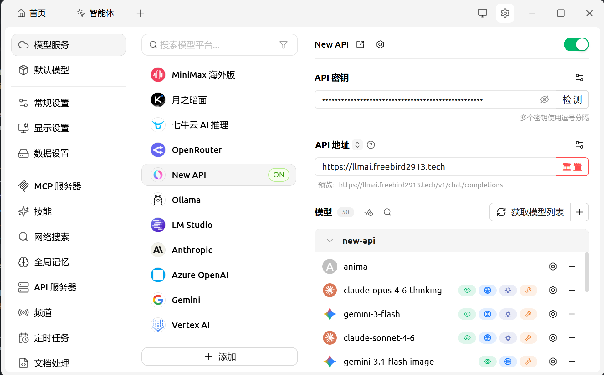

## 1. 为什么选择 New API 与 Cherry Studio？

- **New API** 是目前非常流行的 API 聚合与分发管理系统（基于 One API 开发），支持将各种大语言模型（如 OpenAI、Claude、DeepSeek、Gemini、国内主流大模型等）统一转为标准 OpenAI API 格式。
- **Cherry Studio** 是一款颜值极高、功能强大的跨平台桌面 AI 客户端，支持多种服务商接入，拥有优秀的提示词管理、多助手对话、代码高亮以及内置 PDF/图片解析等功能。

将 New API 接入 Cherry Studio，可以让你在本地只配置一个服务商，就能轻松调用 New API 中聚合的所有大模型，避免了在客户端中重复配置多个服务商和 API 密钥的繁琐流程，还能方便地进行额度控制和日志查看。

---

## 2. 准备工作：从 New API 获取接入凭证

在开始配置 Cherry Studio 之前，我们需要在 New API 的后台生成相应的令牌（API Key）并获取 API 的基础 URL。

### 步骤 2.1：获取 New API 基础 URL（Base URL）

New API 的基础 URL 通常就是你访问 New API 网页的前缀加上 `/v1`。

- 例如，如果你的 New API 访问地址是：`https://llmai.freebird2913.tech`
- 那么你的 API 基础 URL 就是：`https://llmai.freebird2913.tech`

> 💡 **提示**：如果是本地部署且没有域名，一般是 `http://localhost:3000/v1`。

### 步骤 2.2：创建/获取 New API 令牌（API Key）

1. 登录你的 **New API** 管理后台。
2. 导航至左侧菜单的 **“令牌”**（Tokens）页面。
3. 点击 **“添加新的令牌”** 按钮。
4. 在弹出的窗口中设置令牌参数：
   - **名称**：起一个好记的名字，例如 `CherryStudio-Local`。
   - **过期时间**：建议设为“永不过期”，或者根据安全策略设定。
   - **额度限制**：可以设为设为“无限额度”或者设置具体限制额度以防滥用。
5. 点击 **“提交”**。
6. 令牌创建成功后，在令牌列表中找到刚才创建的令牌，点击右侧的 **“复制”** 按钮。你将得到一个以 `sk-` 开头的长字符串，这就是你的 **API Key**。

---

## 3. 在 Cherry Studio 中配置 New API

Cherry Studio 对 OpenAI 兼容协议的支持非常友好。我们可以通过两种方式接入：一种是直接修改内置的 **OpenAI** 选项，另一种是新建一个 **自定义 (OpenAI)** 服务商。这里我们推荐使用 **自定义 (OpenAI)**，以便将官方 OpenAI 服务与你的 New API 聚合服务区隔开。

### 步骤 3.1：选择 New API

1. 打开 **Cherry Studio** 客户端。
2. 点击左下角的 ⚙️ **设置**（Settings）图标。
3. 在设置页面的左侧导航栏中选择 **“模型服务”**（Providers）。
4. 选择 **“New API”**。

### 步骤 3.2：配置 API 密钥和基础 URL

在刚才添加的 `New API` 选项下，填写我们在第 2 步中获取的信息：

- **API 密钥 (API Key)**：粘贴你从 New API 复制的以 `sk-` 开头的令牌。
- **API 地址 (Base URL)**：填入你的 New API 基础 URL（例如 `https://llmai.freebird2913.tech`）。

> ⚠️ **注意**：部分 Cherry Studio 版本在输入 API 地址时，可能已经默认在末尾追加了 `/v1/chat/completions`，请根据界面上的提示语决定是否包含 `/v1`。通常情况下，只需填写到 _源地址_ 即可（如 `https://llmai.freebird2913.tech`）。

可以看如下图片相应配置

---

## 4. 在 Cherry Studio 中添加和管理模型

配置好连接参数后，我们必须在 Cherry Studio 中启用或手动添加你在 New API 中所拥有的模型。

### 步骤 4.1：获取模型列表

在 Cherry Studio 的自定义服务商配置界面：

- 通常会有一个 **“管理模型”** 或 **“手动添加模型”** 的按钮。
- 点击 **“管理”** 按钮。

### 步骤 4.2：手动添加模型名称

由于 New API 承载了各种不同渠道的模型，Cherry Studio 无法总是自动获取到所有可用模型。你需要根据你在 New API 中配置好的可用模型，手动将它们的名字添加到列表中：

1. 在“添加模型”输入框中输入模型标识符（需与 New API 中的模型代码完全一致），例如：
   - `gpt-4o`
   - `claude-3-5-sonnet`
   - `deepseek-chat`
   - `gemini-1.5-pro`
2. 点击 **“添加”** 或保存。
3. 勾选激活这些模型，使它们在对话窗口的下拉菜单中可见。

---

## 5. 测试与使用

全部配置完成后，即可开始测试是否接入成功。

1. 点击 Cherry Studio 左侧边栏的 💬 **对话**（Chat）图标。
2. 点击上方的新建对话按钮。
3. 在对话框顶部的模型选择下拉菜单中，选择你刚刚配置的 `New API` 下的具体模型（例如 `deepseek-chat` 或 `gpt-4o`）。
4. 输入一条测试消息（如 `你好，请问你是谁？`）并发送。
5. 如果收到正确的回答，说明配置已经完全成功！

---

## 6. 常见问题排查 (FAQ)

### Q1: 发送消息时提示 `404 Not Found` 或者是 `401 Unauthorized`？

- **401 错误**：通常是 **API 密钥** 填写错误，请重新在 New API 复制令牌，确认没有多余的空格，并且该令牌在 New API 中没有被冻结或过期。
- **404 错误**：通常是 **API 地址 (Base URL)** 填写错误，或者请求的模型名称不正确。检查你的 API 地址是否写成了 `https://llmai.freebird2913.tech`，或者多写了 `/v1/chat/completions`。

### Q2: 提示额度不足 (Quota Insufficient)？

- 这说明你在 New API 创建的令牌额度已耗尽，或者 New API 绑定的渠道余额不足。请前往 New API 后台检查令牌剩余额度以及渠道健康状态。

### Q3: 为什么部分模型无法使用流式传输（打字机效果）？

- 大部分主流模型都支持流式输出。如果在 Cherry Studio 中打字机效果失效，请检查 New API 的渠道配置，并确保在 Cherry Studio 的模型设置中没有关闭流式传输选项。

---

## 7. 总结

通过将 New API 与 Cherry Studio 结合，你可以享受到极佳的本地多模型聚合对话体验。只需管理一个 New API 的密钥，就能随时在 Cherry Studio 中切换使用 GPT、Claude 和 DeepSeek 等顶级模型。赶快去配置你的专属 AI 工作台吧！
