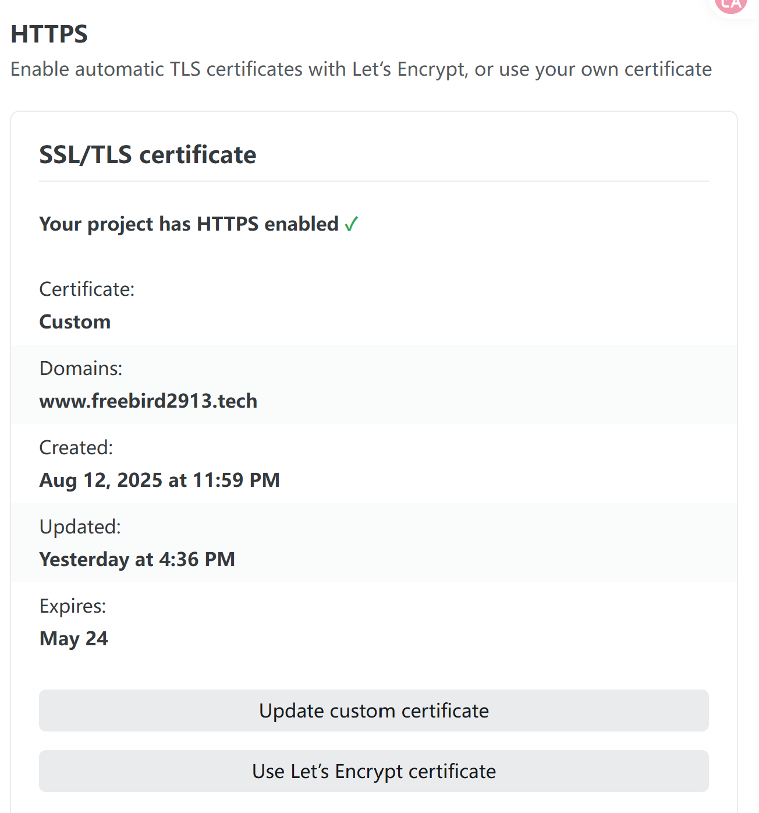
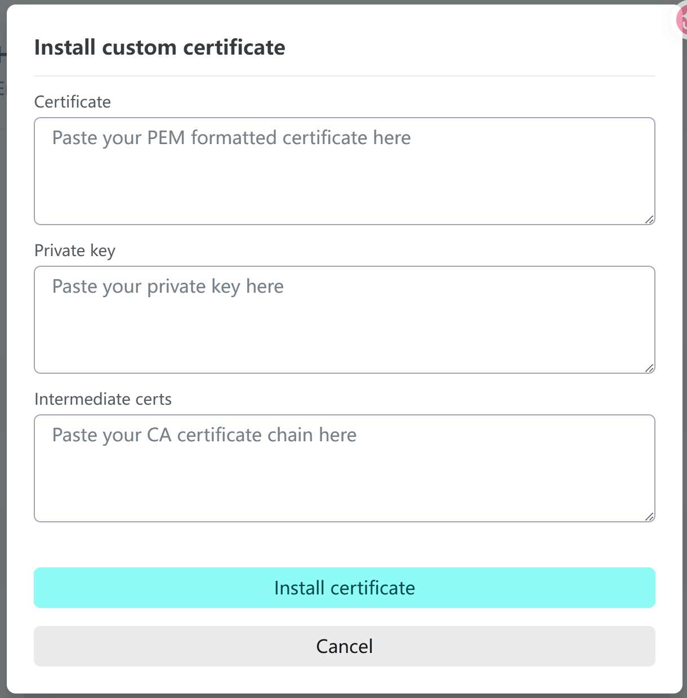
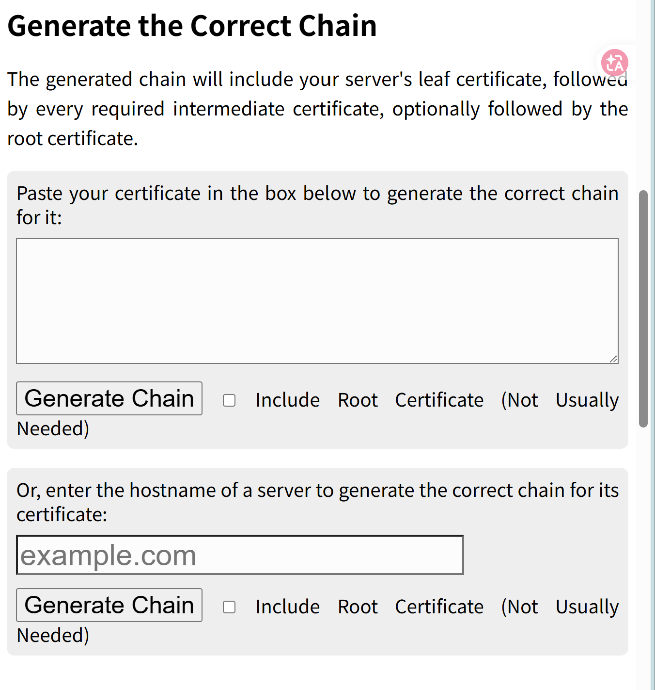

# Netlify 自定义域名添加 SSL 证书开启 HTTPS 完整指南

当你使用 **Netlify** 部署静态博客并绑定自定义域名时，可能会遇到 SSL 证书无法自动续期的问题。本文将详细介绍如何手动上传自定义 SSL 证书，确保你的网站始终保持 HTTPS 安全访问。

## 什么是 Netlify

**Netlify** 是一个优秀的静态网站托管平台，专为现代前端工作流设计。它提供了以下核心功能：

- **自动化部署**：与 Git 仓库无缝集成，推送即部署
- **全球 CDN**：边缘节点加速，提升访问速度
- **自定义域名**：支持绑定自己的域名
- **自动 HTTPS**：默认提供 Let's Encrypt 证书

## 为什么选择 Netlify

相比其他静态托管服务，Netlify 具有以下优势：

| 特性 | Netlify | GitHub Pages |
|------|---------|--------------|
| 国内访问速度 | 较快 | 较慢 |
| 自动 HTTPS | 支持 | 支持 |
| 自定义构建 | 灵活 | 有限 |
| 回滚机制 | 完善 | 基础 |

**多平台部署策略**：本站点同时使用了 **Vercel** 和 **Netlify** 进行双重部署，这样即使一个平台出现故障，另一个也能保证网站正常访问。

## 为什么需要上传自定义 SSL 证书

在以下场景中，你需要手动配置 SSL 证书：

1. **多平台部署冲突**：当同时使用 Vercel 和 Netlify 部署同一域名时，Netlify 的自动证书续期可能会失败
2. **使用特定证书提供商**：需要使用特定 CA 签发的证书（如 ZeroSSL、Cloudflare 等）
3. **通配符证书**：使用通配符证书统一管理多个子域名

## 前置准备

在开始之前，请确保你已准备好以下材料：

- [ ] 已在 Netlify 上部署网站并绑定自定义域名
- [ ] 已申请 SSL 证书（推荐 [ZeroSSL](https://zerossl.com/) 免费申请）
- [ ] 证书包含以下文件：
  - `Certificate`（证书文件，通常为 `.crt` 或 `.pem`）
  - `Private key`（私钥文件，通常为 `.key`）

## 配置步骤

### 1. 进入 HTTPS 设置页面

登录 Netlify 控制台，进入目标项目：

1. 点击左侧菜单栏的 **Project navigation**
2. 选择 **Domain management**
3. 向下滚动找到 **HTTPS** 设置区域

### 2. 打开自定义证书上传

在 HTTPS 设置区域，点击 **Update custom certificate** 按钮：

### 3. 获取 Intermediate Certs

在证书配置表单中，你需要填写三项内容：

| 字段 | 说明 | 获取来源 |
|------|------|----------|
| Certificate | 域名证书 | SSL 提供商下载 |
| Private key | 私钥 | SSL 提供商下载 |
| Intermediate certs | 中间证书 | [What's My Chain Cert?](https://whatsmychaincert.com/) |

**Intermediate certs 获取方法**：

1. 访问 [What's My Chain Cert?](https://whatsmychaincert.com/)
2. 在输入框中粘贴你的 **Certificate** 内容
3. 点击 **Generate Chain** 按钮
4. 浏览器会自动下载一个证书文件

5. 用文本编辑器打开下载的文件，复制全部内容

### 4. 填写并安装证书

回到 Netlify 控制台，依次填入：

1. **Certificate**：粘贴你的域名证书内容
2. **Private key**：粘贴私钥内容
3. **Intermediate certs**：粘贴刚才获取的中间证书内容

确认无误后，点击 **Install certificate** 完成安装。

> **注意**：证书安装后可能需要几分钟才能生效，请耐心等待。

## 验证配置

安装完成后，建议进行以下验证：

1. **浏览器访问**：使用 HTTPS 访问你的域名，检查证书是否有效
2. **SSL 检测工具**：使用 [SSL Labs](https://www.ssllabs.com/ssltest/) 检测证书配置
3. **到期提醒**：记录证书到期时间，设置续期提醒

## 常见问题

### Q: 证书安装后网站无法访问？
A: 检查证书链是否完整，确保证书、私钥、中间证书匹配且格式正确。

### Q: Intermediate certs 是什么？
A: 中间证书用于建立信任链，连接你的域名证书和根证书，确保浏览器能够验证证书的有效性。

### Q: 证书到期后如何续期？
A: 重复上述步骤，使用新的证书文件替换旧的即可。

## 总结

通过本文的步骤，你已经学会了：

1. 了解 Netlify SSL 证书的工作原理
2. 在多平台部署场景下手动配置 SSL 证书
3. 获取并配置 Intermediate certs 完成证书链
4. 验证 HTTPS 配置是否成功

手动配置 SSL 证书虽然比自动续期稍显繁琐，但在特定场景下是必要的解决方案。建议将证书到期时间添加到日历提醒，确保及时续期。

---

> *如果你在配置过程中遇到问题，欢迎在评论区留言交流。*