## 前言


Kali Linux 是面向安全研究、渗透测试、数字取证与安全学习的 Linux 发行版。通过 WSL2（Windows Subsystem for Linux 2），我们可以在 Windows 11 上直接运行 Kali Linux，而不必单独安装虚拟机或双系统。

相比传统虚拟机，WSL2 的优势是启动快、资源占用低、与 Windows 文件系统集成方便；不足是它并不等同于完整虚拟机，部分需要真实内核模块、USB 直通、无线网卡监听模式或复杂网络拓扑的场景仍然更适合虚拟机或实体机。

> 重要提醒：Kali Linux 中的安全工具只能用于授权环境、靶场、实验室或自己拥有的系统。不要对未授权目标进行扫描、攻击或测试。

## 1. 准备条件

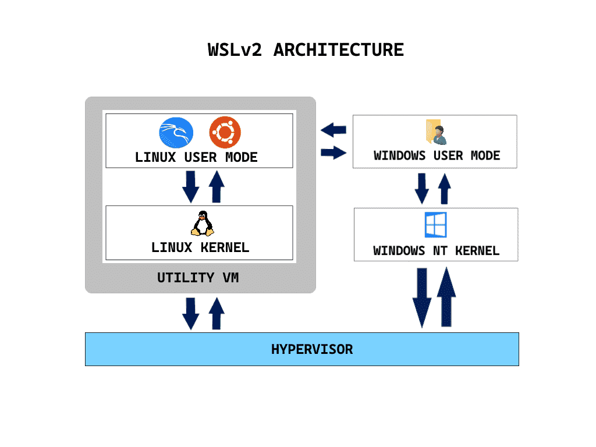

开始之前，请确认你的环境满足以下要求：

- Windows 10 2004 及以上版本，推荐 Windows 11；
- 已开启 CPU 虚拟化；
- 可以使用管理员权限打开 PowerShell；
- 网络可以访问 Microsoft Store 或 WSL 在线发行版源；
- 磁盘空间建议至少预留 20GB。

如果不确定 WSL 是否已经安装，可以在 PowerShell 中执行：

```powershell
wsl --status
```

如果命令不存在或提示未安装，就继续执行下一节。

## 2. 安装 WSL2

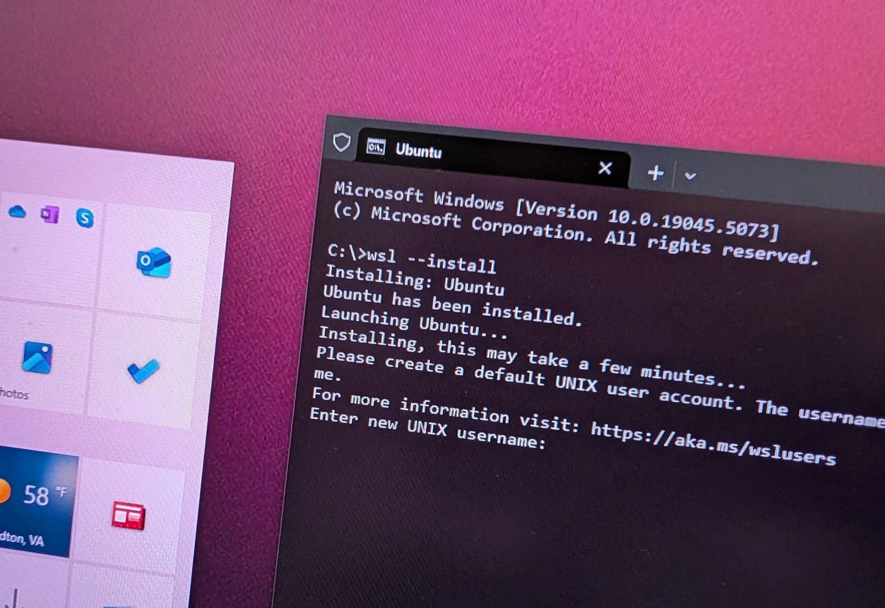

以管理员身份打开 PowerShell，然后执行：

```powershell
wsl --install
```

该命令会自动安装 WSL、虚拟机平台组件，并默认安装一个 Linux 发行版。安装完成后，建议重启电脑。

如果你只想安装 WSL 组件，不想立即安装默认发行版，可以执行：

```powershell
wsl --install --no-distribution
```

重启后确认 WSL 默认版本为 2：

```powershell
wsl --set-default-version 2
```

查看当前已安装发行版：

```powershell
wsl --list --verbose
```

如果某个发行版不是 WSL2，可以使用下面的命令转换：

```powershell
wsl --set-version <发行版名称> 2
```

例如：

```powershell
wsl --set-version kali-linux 2
```

## 3. 安装 Kali Linux

### 3.1 使用 WSL 命令安装

在 PowerShell 中列出可安装的发行版：

```powershell
wsl --list --online
```

如果列表中包含 Kali Linux，可以执行：

```powershell
wsl --install -d kali-linux
```

安装完成后启动 Kali：

```powershell
wsl -d kali-linux
```

首次启动时会要求创建 Linux 用户名和密码。这个密码用于 Kali 内部的 sudo 操作，输入时不会显示字符，这是正常现象。

### 3.2 使用 Microsoft Store 安装


也可以打开 Microsoft Store，搜索 "Kali Linux"，点击安装。安装完成后从开始菜单启动 Kali Linux，并完成首次用户初始化。

### 3.3 检查发行版状态

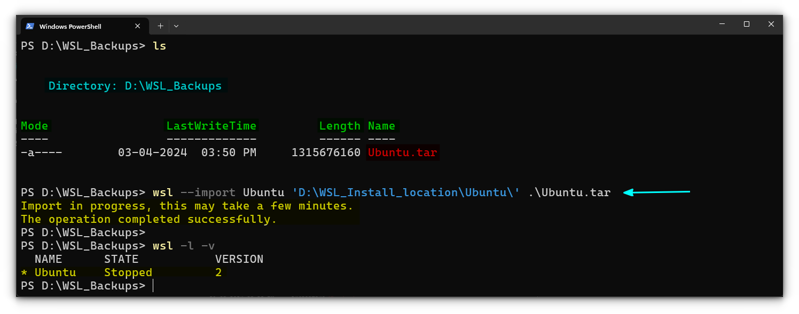

回到 PowerShell 执行：

```powershell
wsl --list --verbose
```

你应该能看到类似输出：

```text
  NAME          STATE           VERSION
* kali-linux    Running         2
```

如果 VERSION 显示为 1，请转换为 WSL2：

```powershell
wsl --set-version kali-linux 2
```

## 4. 初始化 Kali Linux

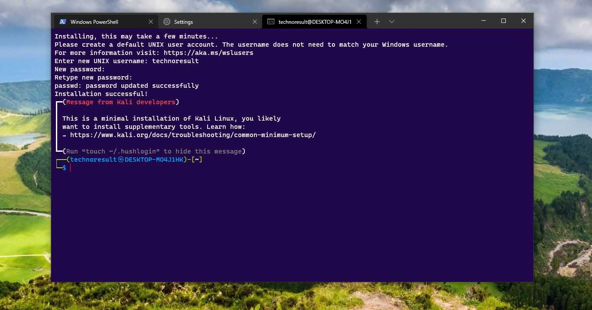

进入 Kali 后，建议先更新软件源和系统包：

```bash
sudo apt update
sudo apt full-upgrade -y
```

清理不再需要的软件包：

```bash
sudo apt autoremove -y
sudo apt clean
```

确认 Kali 版本：

```bash
cat /etc/os-release
uname -a
```

如果你希望后续命令更方便，可以安装一些基础工具：

```bash
sudo apt install -y curl wget git vim nano unzip zip ca-certificates gnupg lsb-release
```

## 5. 配置 systemd

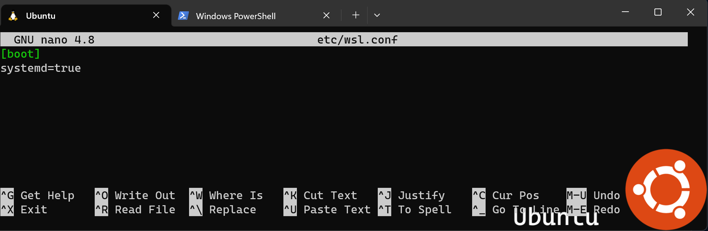

较新的 WSL 已经支持 systemd。启用后可以更接近常规 Linux 使用体验，例如使用 systemctl 管理服务。

编辑 WSL 配置文件：

```bash
sudo nano /etc/wsl.conf
```

写入以下内容：

```ini
[boot]
systemd=true
```

保存后，在 Windows PowerShell 中关闭 WSL：

```powershell
wsl --shutdown
```

重新启动 Kali：

```powershell
wsl -d kali-linux
```

验证 systemd 是否启用：

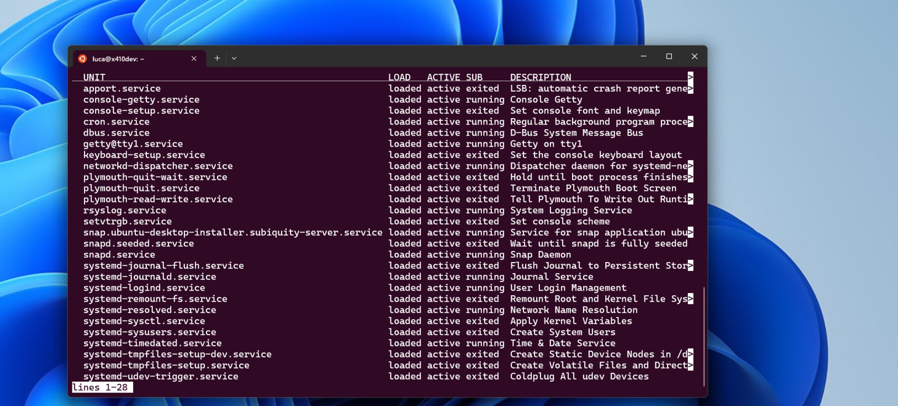

```bash
systemctl status
```

如果能看到 systemd 状态信息，说明启用成功。

## 6. 安装 Kali 常用工具

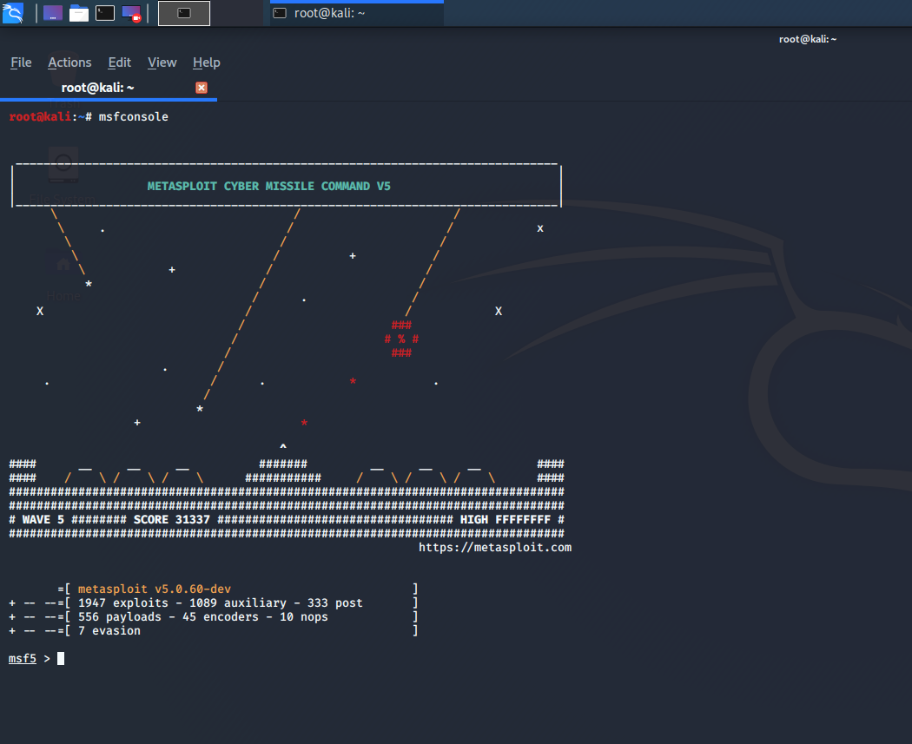

Kali 提供了多个工具包元包（metapackage）。WSL 环境不建议一开始安装所有工具，因为体积较大，而且部分工具依赖图形界面、网卡或内核能力。

常见选择如下：

```bash
sudo apt install -y kali-linux-headless
```

该工具包适合 WSL，无需完整桌面环境，包含很多命令行安全工具。

如果只想按需安装，也可以选择单独安装：

```bash
sudo apt install -y nmap netcat-traditional dnsutils whois gobuster sqlmap nikto hydra john hashcat
```

常用工具示例：

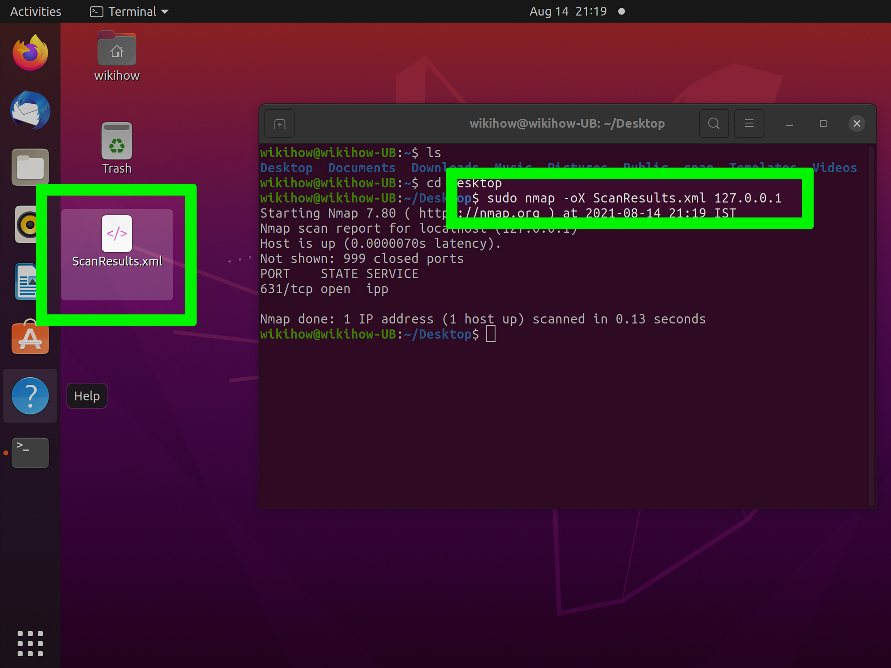

```bash
nmap -sV scanme.nmap.org
whois example.com
dig example.com
```

请只在授权目标上运行测试命令。

## 7. 文件路径与目录使用

WSL2 可以访问 Windows 文件，也可以从 Windows 访问 WSL 文件。

### 7.1 在 Kali 中访问 Windows 文件

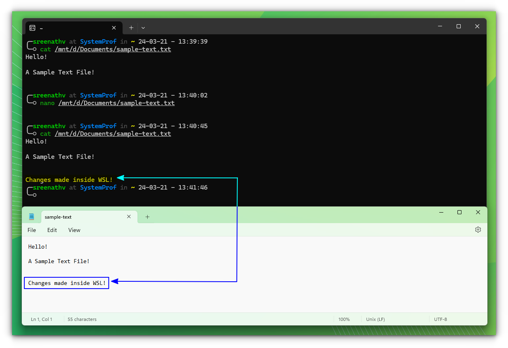

Windows 的磁盘会挂载在 /mnt 目录下。例如 C 盘路径为：

```bash
cd /mnt/c/Users
```

如果你的 Windows 用户名是 `Alice`，桌面路径通常是：

```bash
cd /mnt/c/Users/Alice/Desktop
```

### 7.2 在 Windows 中访问 Kali 文件

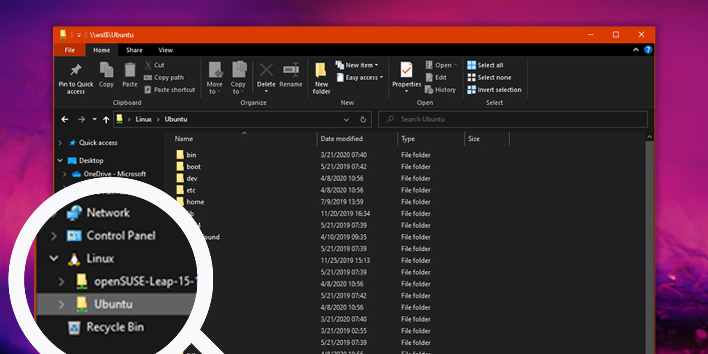

在资源管理器地址栏输入：

```text
\\wsl$\kali-linux
```

或者在 PowerShell 中打开当前 Kali 目录：

```bash
explorer.exe .
```

### 7.3 性能建议

如果是 Linux 项目，建议放在 Kali 自己的 Linux 文件系统中，例如：

```bash
mkdir -p ~/projects
cd ~/projects
```

不要把大量 Linux 项目放在 `/mnt/c` 下长期编译，否则文件 I/O 可能明显变慢。

## 8. 使用图形界面


Windows 11 的 WSLg 可以直接运行部分 Linux 图形应用。比如安装并运行鼠标垫编辑器：

```bash
sudo apt install -y mousepad
mousepad
```

如果想要更完整的 Kali 图形桌面，可以使用 Win-KeX。

安装 Win-KeX：

```bash
sudo apt install -y kali-win-kex
```

启动窗口模式：

```bash
kex --win
```

启动增强会话模式：

```bash
kex --esm
```

停止 KeX 会话：

```bash
kex --stop
```

如果图形界面异常，先关闭 WSL 后重启：

```powershell
wsl --shutdown
```

然后重新进入 Kali 再启动 KeX。

## 9. 网络与端口访问

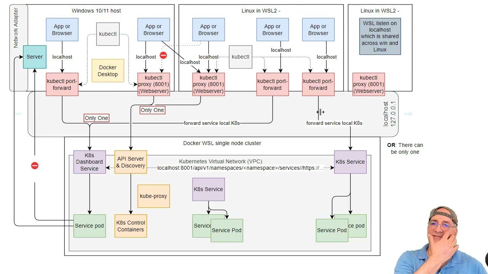

WSL2 中启动的服务通常可以从 Windows 本机访问。例如在 Kali 中启动一个简单 HTTP 服务：

```bash
python3 -m http.server 8000
```

然后在 Windows 浏览器访问：

```text
http://localhost:8000
```

如果需要查看 Kali 的 IP：

```bash
ip addr show eth0
```

或者：

```bash
hostname -I
```

需要注意：WSL2 的 IP 可能会在重启后变化，因此本机开发优先使用 `localhost`。

## 10. 配置 Windows Terminal

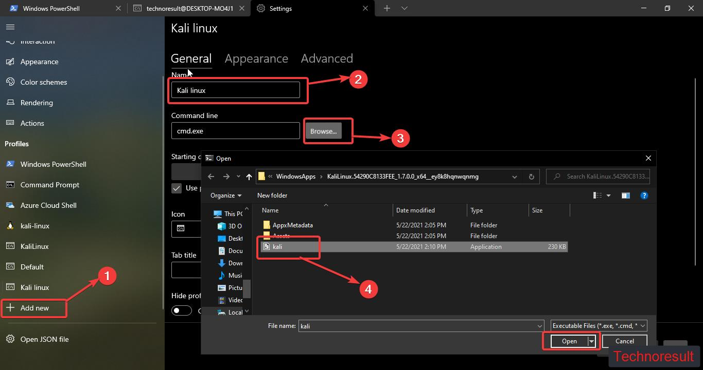

如果你使用 Windows Terminal，可以在下拉菜单中直接选择 Kali Linux。

也可以从 PowerShell 启动：

```powershell
wsl -d kali-linux
```

设置默认 WSL 发行版：

```powershell
wsl --set-default kali-linux
```

之后直接执行：

```powershell
wsl
```

就会进入 Kali Linux。

## 11. 备份、导出与迁移

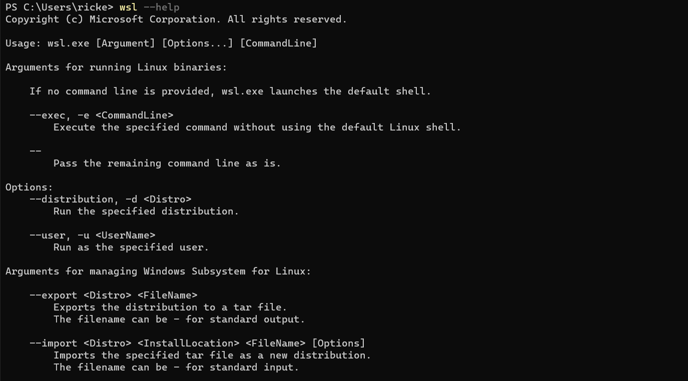

WSL 发行版可以导出为 tar 文件，方便备份或迁移。

先关闭 WSL：

```powershell
wsl --shutdown
```

导出 Kali：

```powershell
wsl --export kali-linux D:\backup\kali-linux.tar
```

以后可以导入到新目录：

```powershell
wsl --import kali-linux-restored D:\WSL\kali-linux-restored D:\backup\kali-linux.tar --version 2
```

如果不再需要某个发行版，可以注销删除：

```powershell
wsl --unregister kali-linux-restored
```

注意：注销会删除该发行版内的所有数据，执行前务必确认已经备份。

## 12. 常见问题排查

### 12.1 WSL 安装失败

先更新 WSL：

```powershell
wsl --update
wsl --shutdown
```

然后重启电脑再试。

如果提示虚拟化不可用，请检查 BIOS/UEFI 中是否启用了 Intel VT-x 或 AMD-V。

### 12.2 apt 更新很慢

可以更换 Kali 软件源。编辑 sources.list：

```bash
sudo nano /etc/apt/sources.list
```

常见官方源格式如下：

```text
deb http://http.kali.org/kali kali-rolling main contrib non-free non-free-firmware
```

保存后执行：

```bash
sudo apt update
```

### 12.3 忘记 Kali 用户密码

在 PowerShell 中以 root 进入 Kali：

```powershell
wsl -d kali-linux -u root
```

修改指定用户密码：

```bash
passwd your_username
```

退出 root 后重新进入 Kali：

```bash
exit
```

### 12.4 WSL 占用磁盘过大

先在 Kali 中清理缓存：

```bash
sudo apt autoremove -y
sudo apt clean
```

然后关闭 WSL：

```powershell
wsl --shutdown
```

如果仍然占用很大，可以考虑导出再导入发行版，或使用 Windows 的虚拟磁盘压缩方法。

### 12.5 某些工具无法使用

WSL2 不是完整虚拟机，以下能力可能受限：

- 无线网卡监听模式；
- 部分 USB 设备直通；
- 需要加载特殊 Linux 内核模块的工具；
- 复杂的二层网络攻击实验；
- 需要完整桌面环境和硬件加速的场景。

遇到这些需求时，建议使用 Kali 虚拟机、实体机或专门实验环境。

## 13. 推荐日常工作流

一个比较稳妥的使用流程是：

1. 在 Windows Terminal 中启动 Kali；
2. 项目文件放在 `~/projects`；
3. 常规更新使用 `sudo apt update && sudo apt full-upgrade -y`；
4. 工具按需安装，不盲目安装全部工具包；
5. 实验前导出备份；
6. 只在授权靶场和合法范围内测试。

示例：创建一个学习目录：

```bash
mkdir -p ~/projects/security-lab
cd ~/projects/security-lab
```

记录实验笔记：

```bash
nano notes.md
```

## 总结

通过 WSL2 安装 Kali Linux，可以在 Windows 上快速获得一个轻量、易用、与本机集成度高的安全学习环境。它非常适合学习 Linux 命令、安全工具、Web 安全基础、CTF 入门和日常脚本测试。

但也要记住：WSL2 Kali 并不能完全替代虚拟机或实体机。对于无线安全、USB 设备、内核模块和复杂网络实验，仍然建议使用完整 Kali 虚拟机或独立实验设备。合理选择环境，遵守授权边界，才能安全、高效地学习网络安全。
