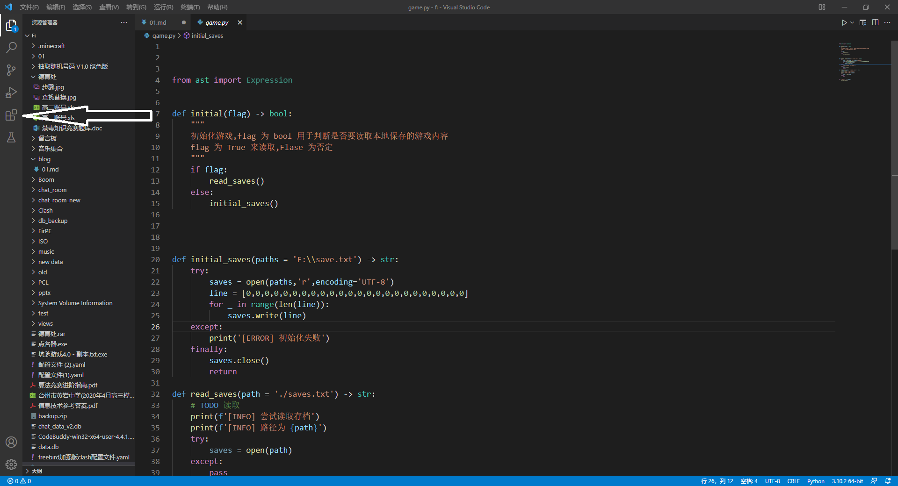
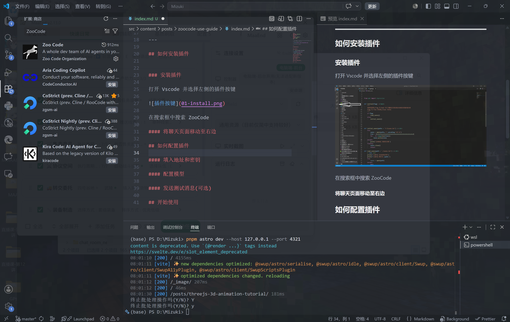
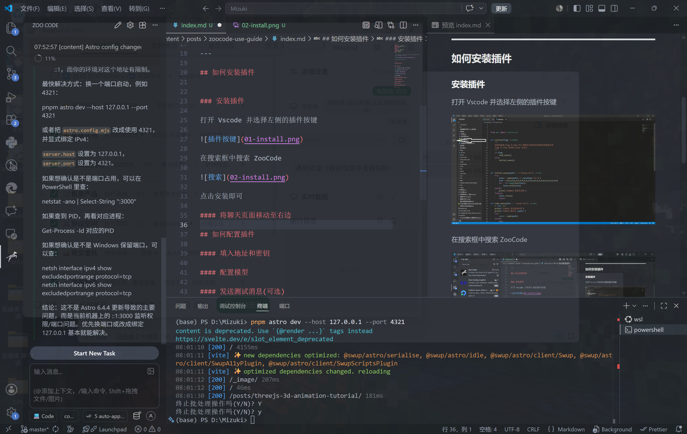
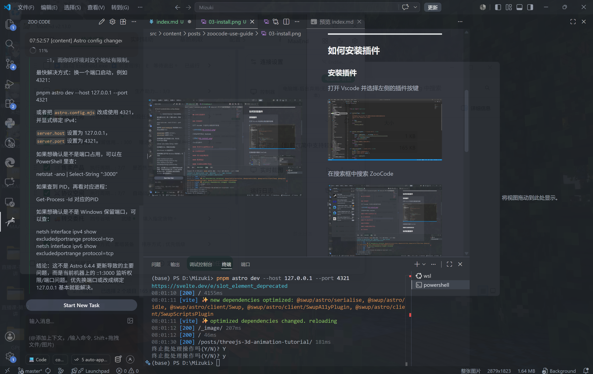
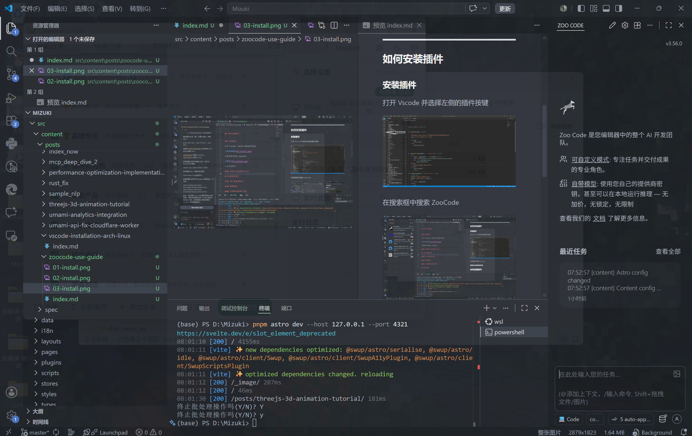
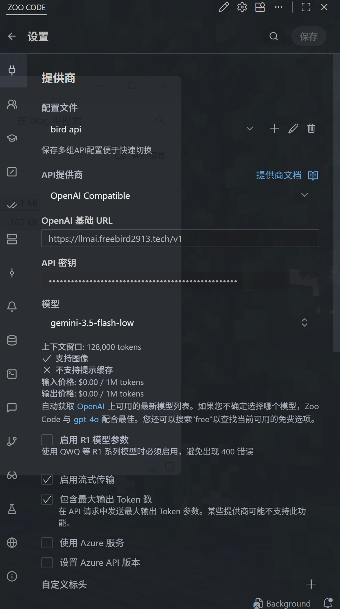
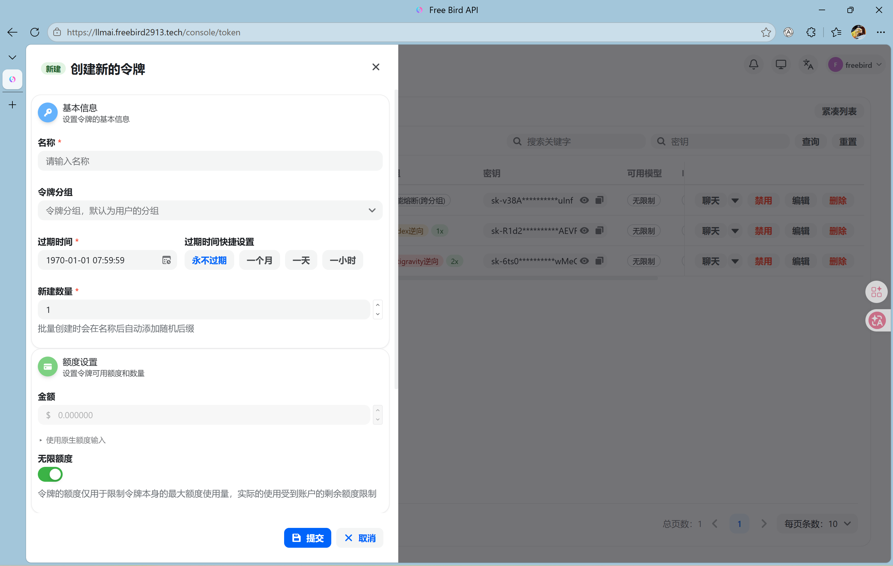
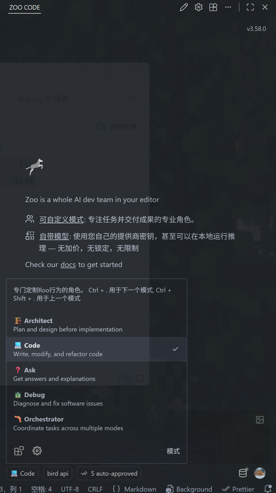

# ZooCode 使用指南：安装、配置与快速上手

> 如果你需要一个稳定的 AI API 提供平台，可以尝试由我运行并维护的 **BIRD API**。
>
> 👉 [AI LLM](https://llmai.freebird2913.tech)
>
> 如果它对你有帮助，也欢迎支持一下。

---

## 📌 本文你会完成什么

这篇文章会带你从零开始完成 ZooCode 的基础配置。完成后，你就可以在 VS Code 中直接使用 AI 助手进行提问、写代码、改代码和排查问题。

| 步骤 | 内容                | 目标                         |
| ---- | ------------------- | ---------------------------- |
| 1    | 安装 ZooCode 扩展   | 在 VS Code 中启用插件        |
| 2    | 调整聊天面板位置    | 将聊天区域移动到更顺手的位置 |
| 3    | 配置 API 地址与密钥 | 连接 BIRD API 或其他兼容服务 |
| 4    | 选择模型            | 指定实际使用的 AI 模型       |
| 5    | 发送测试消息        | 确认配置可用                 |

## ✅ 准备工作

开始之前，请先准备好以下内容：

- 已安装 **Visual Studio Code**；
- 网络环境可以正常访问你的 API 服务；
- 已获取可用的 **API Key**；
- 如果使用 BIRD API，请提前登录网页端获取密钥。

> 本文以 **OpenAI Compatible** 提供商和 **BIRD API** 为例。其他兼容 OpenAI API 格式的平台也可以参考同样的思路进行配置。

---

## 🧩 一、安装 ZooCode 插件

### 1. 打开扩展市场

打开 VS Code，点击左侧活动栏中的 **扩展** 图标。



### 2. 搜索 ZooCode

在扩展搜索框中输入：

```text
ZooCode
```

找到对应插件后，点击进入扩展详情页。



### 3. 安装插件

点击 **Install / 安装** 按钮，等待插件安装完成即可。



> 如果安装后没有看到 ZooCode 面板，可以尝试重新加载 VS Code 窗口，或者在活动栏中查找 ZooCode 图标。

---

## 🧭 二、将聊天页面移动到右侧

默认情况下，插件页面可能位于左侧。为了让代码区域和聊天区域同时可见，建议把 ZooCode 聊天面板移动到右侧。

### 1. 打开右侧边栏

点击 VS Code 右上角的 **侧边栏布局按钮**，打开右侧边栏区域。


### 2. 拖动 ZooCode 面板

打开侧边栏后，选中 ZooCode 插件页面，按住标题区域并拖动到右侧边栏位置，等出现吸附提示后松开鼠标。



移动完成后，你就可以一边查看代码，一边在右侧和 ZooCode 对话。



> 小技巧：右侧聊天面板更适合长时间写代码时使用，尤其是在阅读文件、生成代码和比对修改内容时会更方便。

---

## ⚙️ 三、配置 ZooCode API

### 1. 选择 OpenAI Compatible 提供商

进入 ZooCode 的配置页面，在提供商列表中选择：

```text
OpenAI Compatible
```

这个选项适用于大多数兼容 OpenAI API 格式的平台，例如 BIRD API、自建中转服务或其他第三方 API 服务。

### 2. 填写 API 地址

如果你使用的是 **BIRD API**，API 地址填写为：

```text
https://llmai.freebird2913.tech/v1
```



配置时可以参考下面这张表：

| 配置项       | 推荐填写                             | 说明                 |
| ------------ | ------------------------------------ | -------------------- |
| Provider     | `OpenAI Compatible`                  | 使用 OpenAI 兼容格式 |
| Base URL     | `https://llmai.freebird2913.tech/v1` | BIRD API 接口地址    |
| API Key      | 你的密钥                             | 在网页端获取         |
| Group / 分组 | `auto`                               | 推荐自动选择，更省心 |

### 3. 获取并填写 API Key

API 密钥需要在网页端获取。进入 BIRD API 页面后，找到密钥管理相关入口，复制你的 API Key，并粘贴到 ZooCode 的密钥输入框中。



> 请不要把 API Key 公开发布到文章、仓库或聊天截图中。密钥泄露后可能会造成额度损失。

---

## 🤖 四、配置模型

完成 API 地址和密钥配置后，就可以选择模型了。

### 1. 打开模型选择器

在 ZooCode 中点击模型名称或模型选择区域。

### 2. 等待模型列表加载

点击后稍等片刻，ZooCode 会从 API 服务中读取可用模型列表。

### 3. 选择推荐模型

你可以根据自己的需求选择模型。如果使用 BIRD API，推荐优先尝试：

```text
gpt-5.5
```

> 如果列表没有立刻出现，可以等待几秒后重试，或者检查 API 地址和 API Key 是否填写正确。

## 💾 五、保存配置

完成上面的配置后，务必点击保存。

> **重要提醒：记得保存！！！**
>
> 如果没有保存配置，关闭窗口或切换页面后，刚刚填写的 API 地址、密钥和模型可能不会生效。

---

## 🧪 六、发送测试消息（可选但推荐）

为了确认配置是否成功，建议发送一条测试消息。

### 1. 切换到 Ask 模式

点击 ZooCode 的模式切换菜单。



选择 **Ask** 模式。

### 2. 发送一条简单消息

你可以发送类似下面的测试内容：

```text
你好，请简单介绍一下 ZooCode 能做什么。
```

如果能够正常收到回复，说明 API 地址、API Key 和模型配置已经生效。

---

## 🧰 常见问题排查

### 模型列表加载不出来怎么办？

可以按下面顺序检查：

1. **检查 API 地址**：确认地址末尾包含 `/v1`；
2. **检查 API Key**：确认密钥没有多复制空格或换行；
3. **检查网络连接**：确认当前网络可以访问 API 服务；
4. **重新保存配置**：修改配置后再次点击保存；
5. **重启 VS Code**：部分插件状态异常时，重启后会恢复。

### 发送消息没有回复怎么办？

优先检查以下内容：

- 当前选择的模型是否可用；
- API Key 是否仍有额度；
- 分组是否填写为 `auto`；
- Base URL 是否填写为完整地址；
- 是否忘记点击保存配置。

### API Key 应该如何保管？

请记住三点：

- 不要提交到 Git 仓库；
- 不要发到公开群聊或截图中；
- 如果怀疑泄露，立即前往平台重置密钥。

---

## 🚀 开始使用

到这里，你已经完成了 ZooCode 的基础安装和配置。接下来可以尝试让它帮你完成这些事情：

- 解释项目中的某个文件；
- 生成一个小功能；
- 优化已有代码；
- 排查报错原因；
- 编写 Markdown 文档；
- 总结一段代码的作用。

祝你使用愉快，开始你的 AI 编程助手之旅吧！
